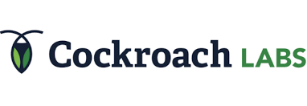

+++
title = "关于"
linkTitle = "关于"
date = 2024-11-19T10:25:52+08:00
type = "docs"
description = ""
isCJKLanguage = true
draft = false
[menu.main]
    weight = -20

+++

> 原文：[https://grpc.io/about/](https://grpc.io/about/)
>
> 收录该文档的时间：`2024-11-19T10:19:42+08:00`

# About gRPC

### Who is using gRPC and why



gRPC is a modern open source high performance Remote Procedure Call (RPC) framework that can run in any environment. It can efficiently connect services in and across data centers with pluggable support for load balancing, tracing, health checking and authentication. It is also applicable in last mile of distributed computing to connect devices, mobile applications and browsers to backend services.

### The main usage scenarios

- Efficiently connecting polyglot services in microservices style architecture
- Connecting mobile devices, browser clients to backend services
- Generating efficient client libraries

### Core features that make it awesome

- Idiomatic client libraries in 11 languages
- Highly efficient on wire and with a simple service definition framework
- Bi-directional streaming with http/2 based transport
- Pluggable auth, tracing, load balancing and health checking

## Who’s using gRPC and why?

Many companies are already using gRPC for connecting multiple services in their environments. The use case varies from connecting a handful of services to hundreds of services across various languages in on-prem or cloud environments. Below are details and quotes from some of our early adopters.

Check out what people are saying below.

At Square, we have been collaborating with Google so that we can replace all uses of our custom RPC solution to use gRPC. We decided to move to gRPC because of its open support for multiple platforms, the demonstrated performance of the protocol, and the ability to customize and adapt it to our network. Developers at Square are looking forward to being able to take advantage of writing streaming APIs and in the future, push gRPC to the edges of the network for integration with mobile clients and third party APIs.

In our initial use of gRPC we’ve been able to extend it easily to live within our opinionated ecosystem. Further, we’ve had great success making improvements directly to gRPC through pull requests and interactions with Google’s team that manages the project. We expect to see many improvements to developer productivity, and the ability to allow development in non-JVM languages as a result of adopting gRPC.

Our switch from a home-grown RPC system to gRPC was seamless. We quickly took advantage of the per-stream flow control to provide better scheduling of large RPCs over the same connection as small ones.

With support for high performance bi-directional streaming, TLS based security, and a wide variety of programming languages, gRPC is an ideal unified transport protocol for model driven configuration and telemetry.

The fact that gRPC is built on HTTP/2 transport brings us native bi-directional streaming capabilities and flexible custom-metadata in request headers. The first point is important for large payload-exchange and network-telemetry scenarios, while the latter enables us to expand and include capabilities including but not limited to various network element authentication mechanisms. In addition, the wide language binding support that gRPC/proto3 brings, enables us to provide a flexible and rapid development environment for both internal and external consumers. Last but not least, while there are a number of network communication protocols for configuration, operational state retrieval and network telemetry, gRPC provides us with a unified flexible protocol and transport to ease client/server interaction.

## The story behind gRPC

gRPC was initially created by Google, which has used a single general-purpose RPC infrastructure called **Stubby** to connect the large number of microservices running within and across its data centers for over a decade. In March 2015, Google decided to build the next version of Stubby and make it open source. The result was gRPC, which is now used in many organizations outside of Google to power use cases from microservices to the “last mile” of computing (mobile, web, and Internet of Things).

For more background on why we created gRPC, see the [gRPC Motivation and Design Principles]() on the [gRPC blog]().

> Note
>
> 
>
> Our table of **officially supported languages and platforms** has moved! See [Official support](https://grpc.io/docs/#official-support).
