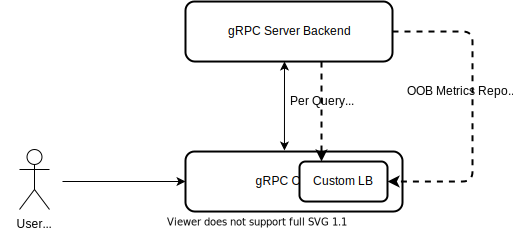

+++
title = "Custom Backend Metrics"
date = 2024-01-17T08:51:13+08:00
weight = 40
type = "docs"
description = ""
isCJKLanguage = true
draft = false
+++

> 原文: [https://grpc.io/docs/guides/custom-backend-metrics/](https://grpc.io/docs/guides/custom-backend-metrics/)

# Custom Backend Metrics 自定义后端指标

A mechanism in the gRPC library that allows users to inject custom metrics at the gRPC server and consume at gRPC clients to make your custom load balancing algorithms.

​	gRPC 库中的一种机制，允许用户在 gRPC 服务器中注入自定义指标，并在 gRPC 客户端中使用这些指标，以创建自定义负载平衡算法。

### Overview 概述

Simple load balancing decisions can be made by taking into account local or global knowledge of a backend’s load, for example CPU. More sophisticated load balancing decisions are possible with application specific knowledge, e.g. queue depth, or by combining multiple metrics.

​	可以通过考虑后端的负载（例如 CPU）的本地或全局知识来做出简单的负载平衡决策。通过应用程序特定的知识（例如队列深度）或通过组合多个指标，可以做出更复杂的负载平衡决策。

The custom backend metrics feature exposes APIs to allow users to implement the metrics feedback in their LB policies.

​	自定义后端指标功能公开 API，允许用户在其 LB 策略中实现指标反馈。

### Use Cases 用例

The feature is mainly for advanced use cases where a custom LB policy is used to route traffic more intelligently to a list of backend servers to improve the routing performance, e.g. a weighted round robin LB policy.

​	此功能主要用于高级用例，其中使用自定义 LB 策略将流量更智能地路由到后端服务器列表以提高路由性能，例如加权循环 LB 策略。

gRPC traditionally allows users to plug in their own load balancing policies, see [guide](). For xDS users, [custom load balancer](https://github.com/grpc/proposal/blob/master/A52-xds-custom-lb-policies.md) can be configured to select the custom LB policy.

​	gRPC 传统上允许用户插入自己的负载均衡策略，请参阅指南。对于 xDS 用户，可以配置自定义负载均衡器来选择自定义 LB 策略。

### Metrics Reporting 指标报告

Open Request Cost Aggregation ([ORCA](https://github.com/cncf/xds/blob/main/xds/data/orca/v3/orca_load_report.proto)) is an open standard for conveying backend metrics information. gRPC uses ORCA service and metrics standards and supports two metrics reporting mechanisms:

​	开放式请求成本聚合 (ORCA) 是一种用于传达后端指标信息的开放式标准。gRPC 使用 ORCA 服务和指标标准，并支持两种指标报告机制：

- Per-query metrics reporting: the backend server attaches the injected custom metrics in the trailing metadata when the corresponding RPC finishes. This is typically useful for short RPCs like unary calls.

  ​	按查询指标报告：后端服务器在相应 RPC 完成时将注入的自定义指标附加到尾部元数据中。这通常适用于短 RPC，如一元调用。

- Out-of-band metrics reporting: the backend server periodically pushes metrics data, e.g. cpu and memory utilization, to the client. This is useful for all situations: unary calls, long RPCs in streaming calls, or no RPCs. However, out-of-band metrics reporting does not send query cost metrics. The metrics emission frequency is user-configurable, and this configuration resides in the custom load balancing policy.

  ​	带外指标报告：后端服务器定期将指标数据（例如，CPU 和内存利用率）推送到客户端。这适用于所有情况：一元调用、流调用中的长 RPC 或无 RPC。但是，带外指标报告不发送查询成本指标。指标发送频率可由用户配置，此配置驻留在自定义负载均衡策略中。

The diagram shows the architecture where a user creates their own LB policy that implements backend metrics feedback.

​	该图显示了用户创建自己的 LB 策略的体系结构，该策略实现了后端指标反馈。

### Implementation 实现

For more details, please see gRPC [proposal A51](https://github.com/grpc/proposal/blob/master/A51-custom-backend-metrics.md).

​	有关更多详细信息，请参阅 gRPC 提议 A51。

### Language Support 语言支持

| Language 语言 | Example 示例                                                 |
| ------------- | ------------------------------------------------------------ |
| Java          | [Java example Java 示例](https://github.com/grpc/grpc-java/tree/master/examples/example-orca) |
| Go            | [Go example Go 示例](https://github.com/grpc/grpc-go/tree/master/examples/features/orca) |
| C++           | Example upcoming 示例即将推出                                |
