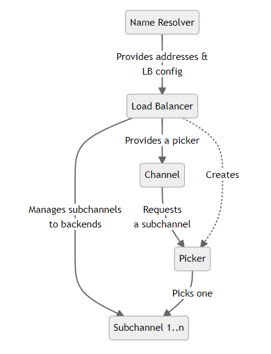

+++
title = "Custom Load Balancing Policies"
date = 2024-01-17T08:51:13+08:00
weight = 50
type = "docs"
description = ""
isCJKLanguage = true
draft = false

+++

> 原文: [https://grpc.io/docs/guides/custom-load-balancing/](https://grpc.io/docs/guides/custom-load-balancing/)

# Custom Load Balancing Policies 自定义负载均衡策略

Explains how custom load balancing policies can help optimize load balancing under unique circumstances.

​	说明自定义负载均衡策略如何在特殊情况下帮助优化负载均衡。

### Overview 概述

One of the key features of gRPC is load balancing, which allows requests from clients to be distributed across multiple servers. This helps prevent any one server from becoming overloaded and allows the system to scale up by adding more servers.

​	gRPC 的一项主要功能是负载均衡，它允许将来自客户端的请求分布到多台服务器上。这有助于防止任何一台服务器过载，并允许系统通过添加更多服务器来扩展。

A gRPC load balancing policy is given a list of server IP addresses by the name resolver. The policy is responsible for maintaining connections (subchannels) to the servers and picking a connection to use when an RPC is sent.

​	名称解析器会向 gRPC 负载均衡策略提供服务器 IP 地址列表。该策略负责维护与服务器的连接（子通道），并在发送 RPC 时选择要使用的连接。

### Implementing Your Own Policy 实现您自己的策略

By default the `pick_first` policy will be used. This policy actually does no load balancing but just tries each address it gets from the name resolver and uses the first one it can connect to. By updating the gRPC service config you can also switch to using `round_robin` that connects to every address it gets and rotates through the connected backends for each RPC. There are also some other load balancing policies available, but the exact set varies by language. If the built-in policies do not meet your needs you can also implement you own custom policy.

​	默认情况下，将使用 `pick_first` 策略。此策略实际上不执行负载均衡，而只是尝试从名称解析器获取的每个地址，并使用它可以连接到的第一个地址。通过更新 gRPC 服务配置，您还可以切换到使用 `round_robin` ，它会连接到它获取的每个地址，并为每个 RPC 轮换连接的后端。还有一些其他可用的负载均衡策略，但确切的集合因语言而异。如果内置策略无法满足您的需求，您还可以实现您自己的自定义策略。

This involves implementing a load balancer interface in the language you are using. At a high level, you will have to:

​	这涉及在您使用的语言中实现负载均衡器接口。在较高的级别上，您将必须：

- Register your implementation in the load balancer registry so that it can be referred to from the service config
  将您的实现注册到负载均衡器注册表中，以便可以从服务配置中引用它
- Parse the JSON configuration object of your implementation. This allows your load balancer to be configured in the service config with any arbitrary JSON you choose to support
  解析实现的 JSON 配置对象。这允许您的负载均衡器在服务配置中配置您选择支持的任何任意 JSON
- Manage what backends to maintain a connection with
  管理要与之保持连接的后端
- Implement a `picker` that will choose which backend to connect to when an RPC is made. Note that this needs to be a fast operation as it is on the RPC call path
  实现一个 `picker` ，它将在进行 RPC 时选择要连接的后端。请注意，这需要一个快速操作，因为它位于 RPC 调用路径上
- To enable your load balancer, configure it in your service config
  要启用负载均衡器，请在服务配置中对其进行配置

The exact steps vary by language, see the language support section for some concrete examples in your language.

​	具体步骤因语言而异，请参阅语言支持部分以获取您语言中的一些具体示例。

### Backend Metrics 后端指标

What if your load balancing policy needs to know what is going on with the backend servers in real-time? For this you can rely on backend metrics. You can have metrics provided to you either in-band, in the backend RPC responses, or out-of-band as separate RPCs from the backends. Standard metrics like CPU and memory utilization are provided but you can also implement your own, custom metrics.

​	如果您的负载平衡策略需要了解后端服务器的实时情况，该怎么办？为此，您可以依赖后端指标。您可以通过带内（在后端 RPC 响应中）或带外（作为来自后端的单独 RPC）的方式向您提供指标。提供了 CPU 和内存利用率等标准指标，但您也可以实现自己的自定义指标。

For more information on this, please see the custom backend metrics guide (TBD)

​	有关此信息的更多详情，请参阅自定义后端指标指南 (TBD)

### Service Mesh 服务网格

If you have a service mesh setup where a central control plane is coordinating the configuration of your microservices, you cannot configure your custom load balancer directly via the service config. But support is provided to do this with the xDS protocol that your control plane uses to communicate with your gRPC clients. Please refer to your control plane documentation to determine how custom load balancing configuration is supported.

​	如果您有服务网格设置，其中中央控制平面协调微服务的配置，则无法通过服务配置直接配置自定义负载平衡器。但提供支持，以便使用控制平面用于与 gRPC 客户端通信的 xDS 协议来执行此操作。请参阅控制平面文档，以确定如何支持自定义负载平衡配置。

For more details, please see gRPC [proposal A52](https://github.com/grpc/proposal/blob/master/A52-xds-custom-lb-policies.md).

​	有关更多详细信息，请参阅 gRPC 提议 A52。

### Language Support 语言支持

| Language 语言 | Example 示例                                                 | Notes 备注                                               |
| ------------- | ------------------------------------------------------------ | -------------------------------------------------------- |
| Java          | [Java example Java 示例](https://github.com/grpc/grpc-java/tree/master/examples/src/main/java/io/grpc/examples/customloadbalance) |                                                          |
| Go            |                                                              | Example and xDS support upcoming 示例和 xDS 支持即将推出 |
| C++           |                                                              | Not yet supported 尚未支持                               |
