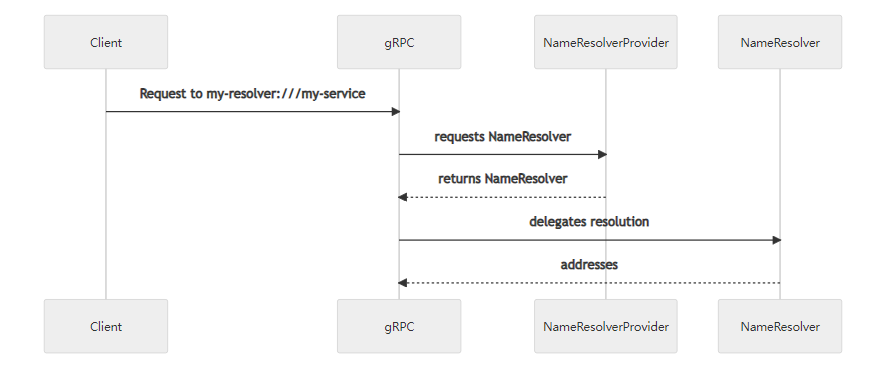

+++
title = "Custom Name Resolution"
date = 2024-01-17T08:51:13+08:00
weight = 60
type = "docs"
description = ""
isCJKLanguage = true
draft = false
+++

> 原文: [https://grpc.io/docs/guides/custom-name-resolution/](https://grpc.io/docs/guides/custom-name-resolution/)

# Custom Name Resolution 自定义名称解析

Explains standard name resolution, the custom name resolver interface, and how to write an implementation.

​	说明标准名称解析、自定义名称解析器接口以及如何编写实现。

### Overview 概述

Name resolution is fundamentally about service discovery. When sending a gRPC request, the client must determine the IP address of the service name. Name resolution is often thought to be the same as [DNS](https://www.ietf.org/rfc/rfc1035.txt). In practice however, DNS is usually augmented with extensions or completely replaced to enable name resolution.

​	名称解析从根本上来说就是服务发现。在发送 gRPC 请求时，客户端必须确定服务名称的 IP 地址。名称解析通常被认为与 DNS 相同。然而，在实践中，DNS 通常会通过扩展进行增强或完全替换，以启用名称解析。

When making a request with a gRPC client, by default, DNS name resolution is used. However, various other name resolution mechanisms may be used:

​	在使用 gRPC 客户端发出请求时，默认情况下会使用 DNS 名称解析。但是，可以使用各种其他名称解析机制：

| Resolver 解析器                  | Example 示例                            | Notes 备注                                                   |
| -------------------------------- | --------------------------------------- | ------------------------------------------------------------ |
| DNS                              | `grpc.io:50051`                         | By default, DNS is assumed. 默认情况下，假定为 DNS。         |
| DNS                              | `dns:///grpc.io:50051`                  | The extra slash is used to provide an authority 额外的斜杠用于提供一个授权 |
| Unix Domain Socket Unix 域套接字 | `uds:///run/containerd/containerd.sock` |                                                              |
| xDS                              | `xds:///wallet.grpcwallet.io`           |                                                              |
| IPv4                             | `ipv4:198.51.100.123:50051`             | Only supported in some languages 仅在某些语言中受支持        |

#### Note 注意

The triple slashes above (`///`) may look unfamiliar if you are used to the double slashes of HTTP, such as `https://grpc.io`. These *target strings* follow the format for [RFC-3986](https://datatracker.ietf.org/doc/html/rfc3986) URIs. The string following the first two slashes and preceding the third (if there is a third at all) is the *authority*. The authority string identifies a server which contains the URIs of all resources. In the case of a conventional HTTP request, the authority over the URI is the server to which the request will be sent. In other cases, the authority will be the identity of the name resolution server, while the resource itself lives on some other server. Some name resolvers have no need for an authority. In this case, the authority string is left empty, resulting in three slashes in a row.
如果您习惯了 HTTP 的双斜杠，例如 `https://grpc.io` ，那么上面的三个斜杠 ( `///` ) 可能看起来不熟悉。这些目标字符串遵循 RFC-3986 URI 的格式。前两个斜杠后面的字符串和第三个斜杠前面的字符串（如果有第三个斜杠）是授权。授权字符串标识包含所有资源 URI 的服务器。在常规 HTTP 请求的情况下，URI 上的授权是将向其发送请求的服务器。在其他情况下，授权将是名称解析服务器的身份，而资源本身位于其他服务器上。某些名称解析器不需要授权。在这种情况下，授权字符串留空，导致连续出现三个斜杠。

Several languages support an interface to allow the user to define their own name resolvers, so that you may define how to resolve any given name. Once registered, a name resolver with the *scheme* `my-resolver` will be picked up when a target string begins with `my-resolver:`. For example, requests to `my-resolver:///my-service` would now use the `my-resolver` name resolver implementation.

​	多种语言支持允许用户定义自己的名称解析器的接口，以便您可以定义如何解析任何给定名称。注册后，当目标字符串以 `my-resolver:` 开头时，将选取具有方案 `my-resolver` 的名称解析器。例如，对 `my-resolver:///my-service` 的请求现在将使用 `my-resolver` 名称解析器实现。

### Custom Name Resolvers 自定义名称解析器

You might consider using a custom name resolver whenever you would like to augment or replace DNS for service discovery. For example, this interface has been used in the past to use [Apache Zookeeper](https://zookeeper.apache.org/) to look up service names. It has also been used to directly interface with the Kubernetes API server for service lookup based on headless Service resources.

​	每当您想扩充或替换 DNS 以进行服务发现时，您都可以考虑使用自定义名称解析器。例如，此接口过去曾用于使用 Apache Zookeeper 来查找服务名称。它还曾用于直接与 Kubernetes API 服务器进行接口，以便根据无头服务资源进行服务查找。

One reason why it might be particularly useful to use a custom name resolver rather than standard DNS is that this interface is *reactive*. Within standard DNS, a client looks up the address for a particular service at the beginning of the connection and maintains its connection to that address for the lifetime of the connection. However, custom name resolvers may be watch-based. That is, they can receive updates from the name server over time and therefore respond intelligently to backend failure as well as backend scale-ups and backend scale-downs.

​	使用自定义名称解析器而不是标准 DNS 可能特别有用的一个原因是此接口具有反应性。在标准 DNS 中，客户端在连接开始时查找特定服务的地址，并在连接的生命周期内保持与该地址的连接。但是，自定义名称解析器可能是基于观察的。也就是说，它们可以随着时间的推移从名称服务器接收更新，因此可以智能地响应后端故障以及后端扩展和后端缩减。

In addition, a custom name resolver may provide the client connection with a *service config*. A service config is a JSON object that defines arbitrary configuration specifying how traffic should be routed to and load balanced across a particular service. At its most basic, this can be used to specify things like that a particular service should use the round robin load balancing policy vs. pick first. However, when a custom name resolver is used in conjunction with arbitrary service config and a [*custom load balancing policy*](), very complex traffic management systems such as xDS may be constructed.

​	此外，自定义名称解析器可以为客户端连接提供服务配置。服务配置是一个 JSON 对象，用于定义任意配置，指定如何将流量路由到特定服务并在此服务之间进行负载平衡。最基本的是，这可用于指定诸如特定服务应使用循环负载平衡策略而不是先选策略之类的内容。但是，当自定义名称解析器与任意服务配置和自定义负载平衡策略结合使用时，可以构建非常复杂的流量管理系统，例如 xDS。

#### Life of a Target String 目标字符串的生命周期

While the exact interface for custom name resolvers differs from language to language, the general structure is the same. The client registers an implementation of a *name resolver provider* to a process-global registry close to the start of the process. The name resolver provider will be called by the gRPC library with a target strings intended for the custom name resolver. Given that target string, the name resolver provider will return an instance of a name resolver, which will interact with the client connection to direct the request according to the target string.

​	虽然自定义名称解析器的确切接口因语言而异，但其一般结构是相同的。客户端将名称解析器提供程序的实现注册到进程全局注册表，该注册表接近进程的开头。gRPC 库将使用旨在用于自定义名称解析器的目标字符串调用名称解析器提供程序。给定该目标字符串，名称解析器提供程序将返回名称解析器的实例，该实例将与客户端连接进行交互以根据目标字符串定向请求。

### Language Support 语言支持

| Language 语言 | Example 示例                                                 |
| ------------- | ------------------------------------------------------------ |
| Java          | [Example 示例](https://github.com/grpc/grpc-java/tree/master/examples/src/main/java/io/grpc/examples/nameresolve) |
| Go            | [Example 示例](https://github.com/grpc/grpc-go/tree/master/examples/features/name_resolving) |
| C++           | Not supported 不支持                                         |
| Python        | Not supported 不支持                                         |
