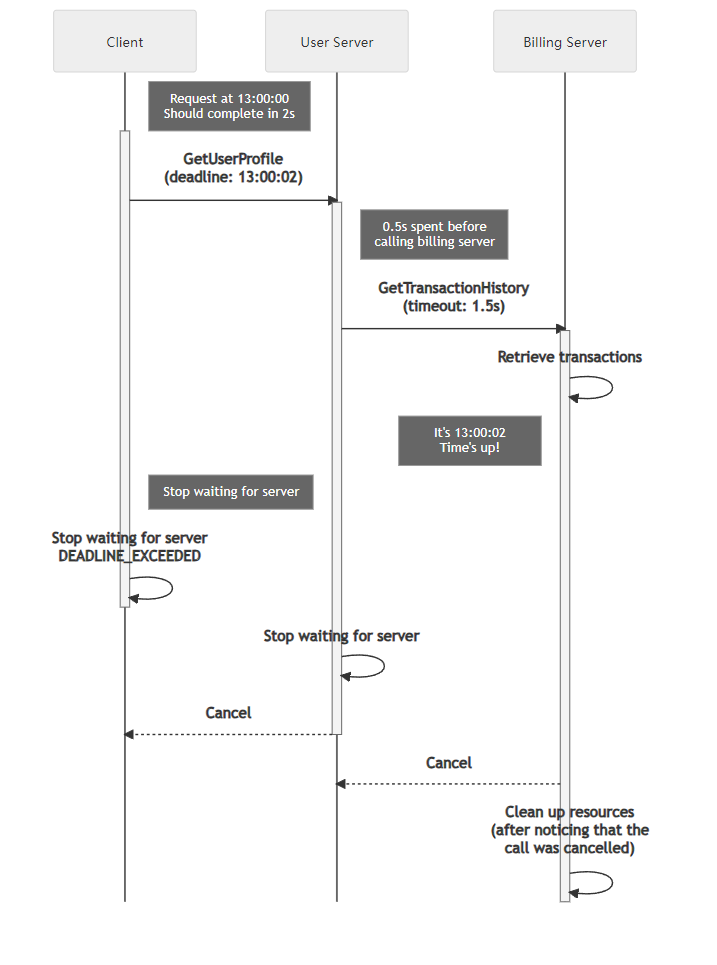

+++
title = "Deadlines"
date = 2024-01-17T08:51:13+08:00
weight = 70
type = "docs"
description = ""
isCJKLanguage = true
draft = false
+++

> 原文: [https://grpc.io/docs/guides/deadlines/](https://grpc.io/docs/guides/deadlines/)

# Deadlines 截止时间

Explains how deadlines can be used to effectively deal with unreliable backends.

​	说明如何使用截止日期有效地处理不可靠的后端。

### Overview 概述

A deadline is used to specify a point in time past which a client is unwilling to wait for a response from a server. This simple idea is very important in building robust distributed systems. Clients that do not wait around unnecessarily and servers that know when to give up processing requests will improve the resource utilization and latency of your system.

​	最后期限用于指定一个时间点，过了这个时间点，客户端不愿意再等待服务器的响应。这个简单的想法在构建健壮的分布式系统中非常重要。不会不必要地等待的客户端和知道何时放弃处理请求的服务器将改善系统的资源利用率和延迟。

Note that while some language APIs have the concept of a **deadline**, others use the idea of a **timeout**. When an API asks for a deadline, you provide a point in time which the request should not go past. A timeout is the max duration of time that the request can take. For simplicity, we will only refer to deadline in this document.

​	请注意，虽然某些语言 API 具有最后期限的概念，但其他 API 使用超时概念。当 API 要求最后期限时，您提供一个请求不应超过的时间点。超时是请求可以花费的最大持续时间。为简单起见，我们在此文档中仅指最后期限。

### Deadlines on the Client 客户端上的最后期限

By default, gRPC does not set a deadline which means it is possible for a client to end up waiting for a response effectively forever. To avoid this you should always explicitly set a realistic deadline in your clients. To determine the appropriate deadline you would ideally start with an educated guess based on what you know about your system (network latency, server processing time, etc.), validated by some load testing.

​	默认情况下，gRPC 不设置最后期限，这意味着客户端可能最终会永远等待响应。为避免这种情况，您应始终在客户端中明确设置一个现实的最后期限。要确定适当的最后期限，您理想的情况是从根据您对系统（网络延迟、服务器处理时间等）的了解进行有根据的猜测开始，然后通过一些负载测试进行验证。

If a server has gone past the deadline when processing a request, the client will give up and fail the RPC with the `DEADLINE_EXCEEDED` status.

​	如果服务器在处理请求时超过了截止时间，客户端将放弃并以 `DEADLINE_EXCEEDED` 状态使 RPC 失败。

### Deadlines on the Server 服务器上的截止时间

A server might receive requests from a client with an unrealistically short deadline that would not give the server enough time to ever respond in time. This would result in the server just wasting valuable resources and in the worst case scenario, crash the server. A gRPC server deals with this situation by automatically cancelling a call (`CANCELLED` status) once a deadline set by the client has passed.

​	服务器可能会收到来自客户端的请求，其截止时间非常短，以至于服务器没有足够的时间及时做出响应。这会导致服务器浪费宝贵的资源，在最坏的情况下，服务器会崩溃。gRPC 服务器通过在客户端设置的截止时间过去后自动取消调用（ `CANCELLED` 状态）来处理这种情况。

Please note that the server application is responsible for stopping any activity it has spawned to service the request. If your application is running a long-running process you should periodically check if the request that initiated it has been cancelled and if so, stop the processing.

​	请注意，服务器应用程序负责停止为服务请求而产生的任何活动。如果您的应用程序正在运行一个长时间运行的进程，您应该定期检查启动它的请求是否已被取消，如果是，则停止处理。

#### Deadline Propagation 截止时间传播

Your server might need to call another server to produce a response. In these cases where your server also acts as a client you would want to honor the deadline set by the original client. Automatically propagating the deadline from an incoming request to an outgoing one is supported by some gRPC implementations. In some languages this behavior needs to be explicitly enabled (e.g. C++) and in others it is enabled by default (e.g. Java and Go). Using this capability lets you avoid the error-prone approach of manually including the deadline for each outgoing RPC.

​	您的服务器可能需要调用另一个服务器来生成响应。在您的服务器也充当客户端的这些情况下，您会希望遵守原始客户端设置的截止时间。某些 gRPC 实现支持将截止时间从传入请求自动传播到传出请求。在某些语言中，此行为需要显式启用（例如 C++），而在其他语言中，此行为默认启用（例如 Java 和 Go）。使用此功能可避免手动包含每个传出 RPC 的截止时间的容易出错的方法。

Since a deadline is set point in time, propagating it as-is to a server can be problematic as the clocks on the two servers might not be synchronized. To address this gRPC converts the deadline to a timeout from which the already elapsed time is already deducted. This shields your system from any clock skew issues.

​	由于截止时间是设定时间点，因此按原样将其传播到服务器可能会出现问题，因为两台服务器上的时钟可能不同步。为了解决此问题，gRPC 将截止时间转换为超时，其中已扣除已用时间。这可保护您的系统免受任何时钟偏差问题的影响。

### Language Support 语言支持

| Language 语言 | Example 示例                                                 |
| ------------- | ------------------------------------------------------------ |
| Java          | [Java example Java 示例](https://github.com/grpc/grpc-java/tree/master/examples/src/main/java/io/grpc/examples/deadline) |
| Go            | [Go example Go 示例](https://github.com/grpc/grpc-go/tree/master/examples/features/deadline) |
| C++           |                                                              |
| Python        | [Python example Python 示例](https://github.com/grpc/grpc/tree/master/examples/python/timeout) |

### Other Resources 其他资源

- [Deadlines blogpost 截止时间博客文章](https://grpc.io/blog/deadlines/)
