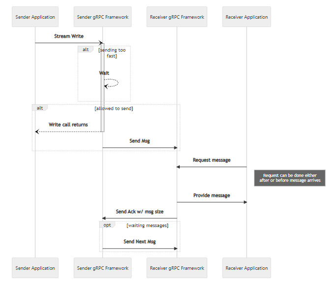

+++
title = "Flow Control"
date = 2024-01-17T08:51:13+08:00
weight = 90
type = "docs"
description = ""
isCJKLanguage = true
draft = false
+++

> 原文: [https://grpc.io/docs/guides/flow-control/](https://grpc.io/docs/guides/flow-control/)

# Flow Control 流控制

Explains what flow control is and how you can manually control it.

​	说明什么是流量控制以及如何手动控制它。

### Overview 概述

Flow control is a mechanism to ensure that a receiver of messages does not get overwhelmed by a fast sender. Flow control prevents data loss, improves performance and increases reliability. It applies to streaming RPCs and is not relevant for unary RPCs. By default, gRPC handles the interactions with flow control for you, though some languages allow you to override the default behavior and take explicit control.

​	流控制是一种机制，可确保消息接收者不会被快速发送者淹没。流控制可防止数据丢失、提高性能并增加可靠性。它适用于流式 RPC，与一元 RPC 无关。默认情况下，gRPC 会为您处理与流控制的交互，但某些语言允许您覆盖默认行为并进行显式控制。

gRPC utilizes the underlying transport to detect when it is safe to send more data. As data is read on the receiving side, an acknowledgement is returned to the sender letting it know that the receiver has more capacity.

​	gRPC 利用底层传输来检测何时可以安全地发送更多数据。随着在接收端读取数据，会向发送端返回确认，让其知道接收端有更多容量。

As needed, the gRPC framework will wait before returning from a write call. In gRPC, when a value is written to a stream, that does not mean that it has gone out over the network. Rather, that it has been passed to the framework which will now take care of the nitty gritty details of buffering it and sending it to the OS on its way over the network.

​	根据需要，gRPC 框架将在返回写入调用之前等待。在 gRPC 中，当某个值被写入流时，并不意味着它已通过网络发送出去。相反，它已传递给框架，该框架现在将负责缓冲它的细节并将其发送到操作系统，以便通过网络传输。

#### Note 注意

The flow is the same for writing from a Server to a Client as when a Client writes to a Server
从服务器写入客户端的流与客户端写入服务器的流相同

#### Warning 警告

There is the potential for a deadlock if both the client and server are doing synchronous reads or using manual flow control and both try to do a lot of writing without doing any reads.
如果客户端和服务器都执行同步读取或使用手动流控制，并且两者都尝试大量写入而不执行任何读取，则可能会发生死锁。

### Language Support 语言支持

| Language 语言 | Example 示例                                                 |
| ------------- | ------------------------------------------------------------ |
| Java          | [Java Example Java 示例](https://github.com/grpc/grpc-java/tree/master/examples/src/main/java/io/grpc/examples/manualflowcontrol) |
