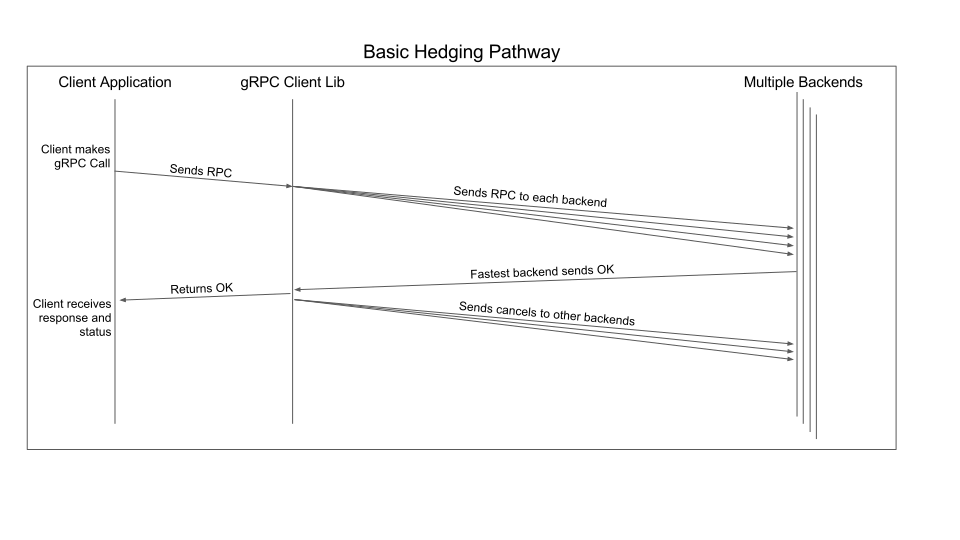

+++
title = "Request Hedging"
date = 2024-01-17T08:51:13+08:00
weight = 140
type = "docs"
description = ""
isCJKLanguage = true
draft = false
+++

> 原文: [https://grpc.io/docs/guides/request-hedging/](https://grpc.io/docs/guides/request-hedging/)

# Request Hedging 请求对冲

Explains what request hedging is and how you can configure it.

​	说明请求对冲是什么以及如何配置它。


### Overview 概述

Hedging is one of two configurable retry policies supported by gRPC. With hedging, a gRPC client sends multiple copies of the same request to different backends and uses the first response it receives. Subsequently, the client cancels any outstanding requests and forwards the response to the application.

​	对冲是 gRPC 支持的两种可配置重试策略之一。使用对冲时，gRPC 客户端会向不同的后端发送同一请求的多个副本，并使用收到的第一个响应。随后，客户端会取消所有未完成的请求，并将响应转发给应用程序。





### Use cases 用例

Hedging is a technique to reduce tail latency in large scale distributed systems. While naive implementations could add significant load to the backend servers, it is possible to get most of the latency reduction effects while increasing load only modestly.

​	对冲是一种减少大规模分布式系统中尾部延迟的技术。虽然简单的实现可能会给后端服务器增加大量负载，但有可能在仅适度增加负载的情况下获得大部分延迟减少效果。

For an in-depth discussion on tail latencies, see the seminal article, [The Tail At Scale](https://research.google/pubs/pub40801/), by Jeff Dean and Luiz André Barroso.

​	有关尾部延迟的深入讨论，请参阅 Jeff Dean 和 Luiz André Barroso 的开创性文章《规模化的尾部》。

#### Configuring hedging in gRPC 在 gRPC 中配置对冲

Hedging is configurable via [gRPC Service Config](https://github.com/grpc/grpc/blob/master/doc/service_config.md), at a per-method granularity. The configuration contains the following knobs:

​	对冲可通过 gRPC 服务配置按方法粒度进行配置。该配置包含以下旋钮：

```
"hedgingPolicy": {
  "maxAttempts": INTEGER,
  "hedgingDelay": JSON proto3 Duration type,
  "nonFatalStatusCodes": JSON array of grpc status codes (int or string)
}
```

- `maxAttempts`: maximum number of in-flight requests while waiting for a successful response. This is a mandatory field, and must be specified. If the specified value is greater than `5`, gRPC uses a value of `5`.
  `maxAttempts` ：等待成功响应时进行中的请求的最大数量。这是一个必填字段，必须指定。如果指定的值大于 `5` ，gRPC 会使用 `5` 的值。
- `hedgingDelay`: amount of time that needs to elapse before the client sends out the next request while waiting for a successful response. This field is optional, and if left unspecified, results in `maxAttempts` number of requests all sent out at the same time.
  `hedgingDelay` ：在等待成功响应时，客户端发送下一个请求之前需要经过的时间量。此字段是可选的，如果未指定，则会导致 `maxAttempts` 数量的请求同时发送。
- `nonFatalStatusCodes`: an optional list of grpc status codes. If any of hedged requests fails with a status code that is not present in this list, all outstanding requests are canceled and the response is returned to the application.
  `nonFatalStatusCodes` ：可选的 grpc 状态代码列表。如果任何对冲请求以不在此列表中的状态代码失败，则所有未完成的请求都会被取消，并将响应返回给应用程序。

#### Hedging policy 对冲策略

When the application makes an RPC call that contains a `hedgingPolicy` configuration in the Service Config, the original RPC is sent immediately, as with a standard non-hedged call. After `hedgingDelay` has elapsed without a successful response, the second RPC will be issued. If neither RPC has received a response after `hedgingDelay` has elapsed again, a third RPC is sent, and so on, up to `maxAttempts`. gRPC call deadlines apply to the entire chain of hedged requests. Once the deadline has passed, the operation fails regardless of in-flight RPCS, and regardless of the hedging configuration.

​	当应用程序发出包含服务配置中 `hedgingPolicy` 配置的 RPC 调用时，原始 RPC 会立即发送，就像标准非对冲调用一样。在 `hedgingDelay` 经过一段时间后仍未收到成功响应，则会发出第二个 RPC。如果在 `hedgingDelay` 再次经过一段时间后，两个 RPC 都没有收到响应，则会发送第三个 RPC，依此类推，最多 `maxAttempts` 次。gRPC 调用截止时间适用于整个对冲请求链。一旦截止时间已过，操作就会失败，无论正在进行的 RPC 如何，也无论对冲配置如何。

When a successful response is received (in response to any of the hedged requests), all outstanding hedged requests are canceled and the response is returned to the client application layer.

​	收到成功响应（响应任何对冲请求）时，所有未完成的对冲请求都会被取消，并且响应会返回给客户端应用程序层。

If an error response with a non-fatal status code (controlled by the `nonFatalStatusCodes` field) is received from a hedged request, then the next hedged request in line is sent immediately, shortcutting its hedging delay. If any other status code is received, all outstanding RPCs are canceled and the error is returned to the client application layer.

​	如果从对冲请求收到具有非致命状态代码（由 `nonFatalStatusCodes` 字段控制）的错误响应，则会立即发送队列中的下一个对冲请求，从而缩短其对冲延迟。如果收到任何其他状态代码，则所有未完成的 RPC 都会被取消，并且错误会返回给客户端应用程序层。

If all instances of a hedged RPC fail, there are no additional retry attempts. Essentially, hedging can be seen as retrying the original RPC before a failure is even received.

​	如果对冲 RPC 的所有实例都失败，则不会进行额外的重试尝试。从本质上讲，对冲可以被视为在收到失败之前重试原始 RPC。

If server pushback that specifies not to retry is received in response to a hedged request, no further hedged requests should be issued for the call.

​	如果收到服务器回推，其中指定不对冲请求进行重试，则不应针对该调用发出进一步的对冲请求。

#### Throttling Hedged RPCs 限制对冲 RPC

gRPC provides a way to throttle hedged RPCs to prevent server overload. Throttling can be configured via the Service Config as well using the `RetryThrottlingPolicy` message. The throttling configuration contains the following:

​	gRPC 提供了一种限制对冲 RPC 的方法，以防止服务器过载。也可以使用 `RetryThrottlingPolicy` 消息通过服务配置来配置限制。限制配置包含以下内容：

```
"retryThrottling": {
  "maxTokens": 10,
  "tokenRatio": 0.1
}
```

For each server name, the gRPC client maintains a `token_count` which is initially set to `max_tokens`. Every outgoing RPC (regardless of service or method invoked) changes `token_count` as follows:

​	对于每个服务器名称，gRPC 客户端维护一个 `token_count` ，该值最初设置为 `max_tokens` 。每次发出的 RPC（无论调用的服务或方法如何）都会按如下方式更改 `token_count` ：

- Every failed RPC will decrement the `token_count` by `1`.
  每次失败的 RPC 都会将 `token_count` 减小 `1` 。
- Every successful RPC will increment the `token_count` by `token_ratio`.
  每次成功的 RPC 都会将 `token_count` 增加 `token_ratio` 。

With hedging, the first request is always sent out, but subsequent hedged requests are sent only if `token_count` is greater than the threshold (defined as `max_tokens / 2`). If `token_count` is less than or equal to the threshold, hedged requests do not block. Instead they are canceled, and if there are no other already-sent hedged RPCs the failure is returned to the client application.

​	在对冲中，第一个请求始终发出，但只有当 `token_count` 大于阈值（定义为 `max_tokens / 2` ）时，才会发送后续的对冲请求。如果 `token_count` 小于或等于阈值，则对冲请求不会阻塞。相反，它们会被取消，并且如果没有其他已发送的对冲 RPC，则会将失败返回给客户端应用程序。

The only requests that are counted as failures for the throttling policy are the ones that fail with a status code that qualifies as a non-fatal status code, or that receive a pushback response indicating not to retry. This avoids conflating server failure with responses to malformed requests (such as the `INVALID_ARGUMENT` status code).

​	根据节流策略被视为失败的唯一请求是那些以符合非致命状态代码的状态代码失败的请求，或者收到指示不重试的回推响应的请求。这避免了将服务器故障与对格式错误的请求的响应（例如 `INVALID_ARGUMENT` 状态代码）混为一谈。

#### Server Pushback 服务器回推

Servers may explicitly pushback by setting metadata in their response to the client. If the pushback says not to retry, no further hedged requests will be sent. If the pushback says to retry after a given delay, the next hedged request (if any) will be issued after the given delay has elapsed.

​	服务器可以通过在对客户端的响应中设置元数据来明确地进行回退。如果回退表示不重试，则不会发送进一步的对冲请求。如果回退表示在给定延迟后重试，则在给定延迟经过后将发出下一个对冲请求（如果有）。

Server pushback is specified using the metadata key, `grpc-retry-pushback-ms`. The value is an ASCII encoded signed 32-bit integer with no unnecessary leading zeros that represents how many milliseconds to wait before sending the next hedged request. If the value for pushback is negative or unparseble, then it will be seen as the server asking the client not to retry at all.

​	服务器回退使用元数据键 `grpc-retry-pushback-ms` 指定。该值是一个 ASCII 编码的带符号 32 位整数，没有不必要的前导零，表示在发送下一个对冲请求之前要等待多少毫秒。如果回退值是负值或无法解析，则将视为服务器要求客户端根本不重试。

### Resources 资源

- [The Tail At Scale
  规模化的尾部](https://research.google/pubs/pub40801/)
- [gRPC Service Config gRPC 服务配置](https://github.com/grpc/grpc/blob/master/doc/service_config.md)
- [gRPC Retry Design gRPC 重试设计](https://github.com/grpc/proposal/blob/master/A6-client-retries.md)

### Language Support 语言支持

| Language 语言 | Example 示例                                                 |
| ------------- | ------------------------------------------------------------ |
| Java          | [Java example Java 示例](https://github.com/grpc/grpc-java/tree/master/examples/src/main/java/io/grpc/examples/hedging) |
| C++           | Not yet available 尚未提供                                   |
| Go            | Not yet supported 尚未支持                                   |
