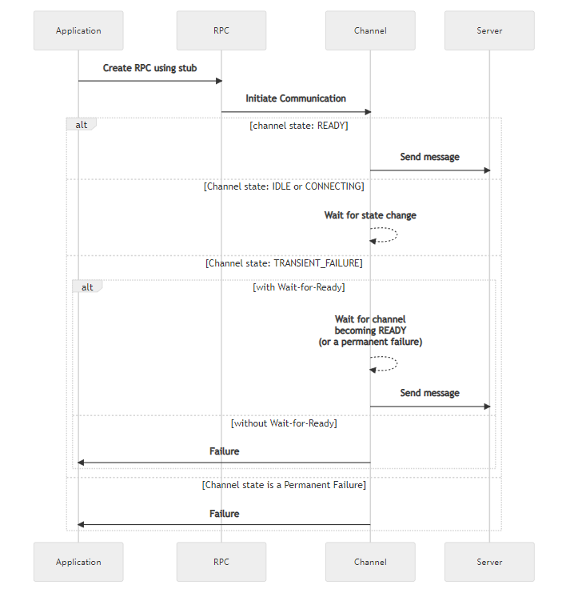
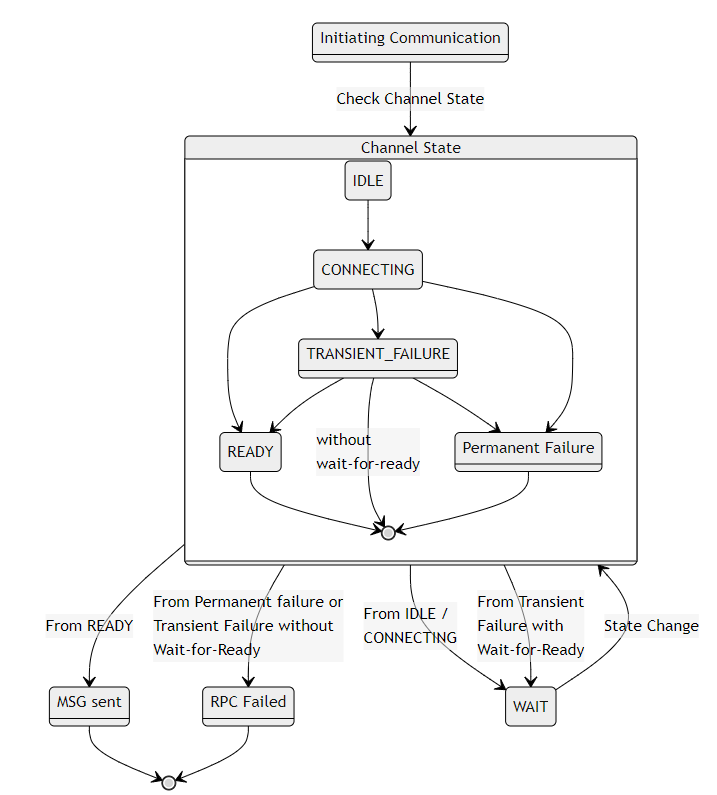

+++
title = "Wait-for-Ready"
date = 2024-01-17T08:51:13+08:00
weight = 150
type = "docs"
description = ""
isCJKLanguage = true
draft = false
+++

> 原文: [https://grpc.io/docs/guides/wait-for-ready/](https://grpc.io/docs/guides/wait-for-ready/)

# Wait-for-Ready 等待就绪

Explains how to configure RPCs to wait for the server to be ready before sending the request.

​	说明如何在发送请求之前配置 RPC 以等待服务器就绪。

### Overview 概述

This is a feature which can be used on a stub which will cause the RPCs to wait for the server to become available before sending the request. This allows for robust batch workflows since transient server problems won’t cause failures. The deadline still applies, so the wait will be interrupted if the deadline is passed.

​	这是一个可以在存根上使用的功能，它将导致 RPC 在发送请求之前等待服务器可用。这允许进行可靠的批处理工作流，因为瞬态服务器问题不会导致故障。截止时间仍然适用，因此如果超过截止时间，等待将被中断。

When an RPC is created when the channel has failed to connect to the server, without Wait-for-Ready it will immediately return a failure; with Wait-for-Ready it will simply be queued until the connection becomes ready. The default is **without** Wait-for-Ready.

​	当在信道无法连接到服务器时创建 RPC 时，如果没有启用“等待就绪”，它将立即返回故障；如果启用了“等待就绪”，它将一直排队，直到连接就绪。默认情况下不启用“等待就绪”。

For detailed semantics see [this](https://github.com/grpc/grpc/blob/master/doc/wait-for-ready.md).

​	有关详细语义，请参阅此处。

### How to use Wait-for-Ready 如何使用“等待就绪”

You can specify for a stub whether or not it should use Wait-for-Ready, which will automatically be passed along when an RPC is created.

​	您可以为存根指定是否应使用“等待就绪”，这将在创建 RPC 时自动传递。

#### Note 注意

The RPC can still fail for other reasons besides the server not being ready, so error handling is still necessary.
RPC 仍然可能由于服务器未就绪以外的其他原因而失败，因此仍然需要进行错误处理。

The following shows the sequence of events that occur, when a client sends a message to a server, based upon channel state and whether or not Wait-for-Ready is set.

​	以下显示了当客户端向服务器发送消息时发生的事件序列，具体取决于信道状态以及是否设置了“等待就绪”。

The following is a state based view

​	以下是基于状态的视图

### Alternatives 备选方案

- Loop (with exponential backoff) until the RPC stops returning transient failures.

  
  循环（采用指数退避），直到 RPC 停止返回瞬态故障。

  - This could be combined, for efficiency, with implementing an `onReady` Handler *(for languages that support this)*.
    为了提高效率，可以将其与实现 `onReady` 处理程序（适用于支持此功能的语言）相结合。

- Accept failures that might have been avoided by waiting because you want to fail fast
  接受可能因等待而避免的失败，因为您希望快速失败

### Language Support 语言支持

| Language 语言 | Example 示例                                                 |
| ------------- | ------------------------------------------------------------ |
| Java          | [Java example Java 示例](https://github.com/grpc/grpc-java/blob/master/examples/src/main/java/io/grpc/examples/waitforready/WaitForReadyClient.java) |
| Go            | [Go example Go 示例](https://github.com/grpc/grpc-go/tree/master/examples/features/wait_for_ready) |
| Python        | [Python example Python 示例](https://github.com/grpc/grpc/tree/master/examples/python/wait_for_ready) |
