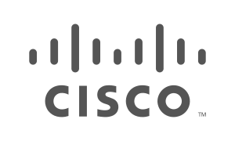

+++
title = "关于"
linkTitle = "关于"
date = 2024-11-19T10:25:52+08:00
type = "docs"
description = ""
isCJKLanguage = true
draft = false
[menu.main]
    weight = -20

+++

> 原文：[https://grpc.io/about/](https://grpc.io/about/)
>
> 收录该文档的时间：`2024-11-19T10:19:42+08:00`

# About gRPC - 关于 gRPC

### Who is using gRPC and why



gRPC is a modern open source high performance Remote Procedure Call (RPC) framework that can run in any environment. It can efficiently connect services in and across data centers with pluggable support for load balancing, tracing, health checking and authentication. It is also applicable in last mile of distributed computing to connect devices, mobile applications and browsers to backend services.

​	gRPC 是一个现代的开源高性能远程过程调用 (RPC) 框架，可以在任何环境中运行。它能够高效地在数据中心内部和跨数据中心连接服务，并支持可插拔的负载均衡、追踪、健康检查和认证功能。同时，gRPC 也适用于分布式计算的最后一公里连接，例如将设备、移动应用和浏览器与后端服务连接。

### 主要使用场景 The main usage scenarios

- Efficiently connecting polyglot services in microservices style architecture
  - 在微服务风格架构中高效连接多语言服务

- Connecting mobile devices, browser clients to backend services
  - 连接移动设备、浏览器客户端与后端服务

- Generating efficient client libraries
  - 生成高效的客户端库

### 令人赞叹的核心功能 Core features that make it awesome

- Idiomatic client libraries in 11 languages
  - 提供 11 种语言的惯用客户端库

- Highly efficient on wire and with a simple service definition framework
  - 在通信中高度高效，且拥有简单的服务定义框架

- Bi-directional streaming with http/2 based transport
  - 基于 HTTP/2 的双向流传输

- Pluggable auth, tracing, load balancing and health checking
  - 支持可插拔的认证、追踪、负载均衡和健康检查

## Who’s using gRPC and why?

Many companies are already using gRPC for connecting multiple services in their environments. The use case varies from connecting a handful of services to hundreds of services across various languages in on-prem or cloud environments. Below are details and quotes from some of our early adopters.

​	许多公司已经在使用 gRPC 来连接其环境中的多个服务。使用场景从连接少数服务到连接数百种语言的服务，覆盖本地部署和云环境。以下是一些早期采用者的详细信息及引用。

Check out what people are saying below.

​	看看下面用户的评价。

At Square, we have been collaborating with Google so that we can replace all uses of our custom RPC solution to use gRPC. We decided to move to gRPC because of its open support for multiple platforms, the demonstrated performance of the protocol, and the ability to customize and adapt it to our network. Developers at Square are looking forward to being able to take advantage of writing streaming APIs and in the future, push gRPC to the edges of the network for integration with mobile clients and third party APIs.

​	在 Square，我们与 Google 合作，用 gRPC 替代我们所有自定义 RPC 解决方案的使用。我们决定迁移到 gRPC 是因为它对多平台的开放支持、协议表现出的性能，以及它能够定制并适配我们的网络。Square 的开发者期待能够利用 gRPC 来编写流式 API，并在未来将 gRPC 推向网络边缘，以便与移动客户端和第三方 API 集成。

In our initial use of gRPC we’ve been able to extend it easily to live within our opinionated ecosystem. Further, we’ve had great success making improvements directly to gRPC through pull requests and interactions with Google’s team that manages the project. We expect to see many improvements to developer productivity, and the ability to allow development in non-JVM languages as a result of adopting gRPC.

​	在最初使用 gRPC 时，我们轻松地将其扩展到适应我们特定需求的生态系统。此外，通过提交拉取请求和与 Google 项目管理团队的互动，我们成功地直接改进了 gRPC。我们期望通过采用 gRPC 来显著提升开发者的生产力，并允许使用非 JVM 语言进行开发。

Our switch from a home-grown RPC system to gRPC was seamless. We quickly took advantage of the per-stream flow control to provide better scheduling of large RPCs over the same connection as small ones.

​	我们从自研 RPC 系统迁移到 gRPC 的过程非常顺利。我们迅速利用了每个流的流量控制功能，以便在同一连接上更好地调度大规模 RPC 和小规模 RPC。

With support for high performance bi-directional streaming, TLS based security, and a wide variety of programming languages, gRPC is an ideal unified transport protocol for model driven configuration and telemetry.

​	凭借对高性能双向流传输、基于 TLS 的安全性以及多种编程语言的支持，gRPC 是用于模型驱动配置和遥测的理想统一传输协议。

The fact that gRPC is built on HTTP/2 transport brings us native bi-directional streaming capabilities and flexible custom-metadata in request headers. The first point is important for large payload-exchange and network-telemetry scenarios, while the latter enables us to expand and include capabilities including but not limited to various network element authentication mechanisms. In addition, the wide language binding support that gRPC/proto3 brings, enables us to provide a flexible and rapid development environment for both internal and external consumers. Last but not least, while there are a number of network communication protocols for configuration, operational state retrieval and network telemetry, gRPC provides us with a unified flexible protocol and transport to ease client/server interaction.

​	gRPC 基于 HTTP/2 传输，这使我们能够原生支持双向流传输，并在请求头中灵活使用自定义元数据。前者对于大负载交换和网络遥测场景非常重要，而后者则使我们能够扩展并包含各种网络元素身份验证机制等功能。此外，gRPC/proto3 提供的广泛语言绑定支持，为内部和外部消费者提供了灵活且快速的开发环境。最后，尽管存在许多网络通信协议用于配置、操作状态检索和网络遥测，gRPC 通过统一灵活的协议和传输方式简化了客户端/服务器交互。

## gRPC 的故事 The story behind gRPC

gRPC was initially created by Google, which has used a single general-purpose RPC infrastructure called **Stubby** to connect the large number of microservices running within and across its data centers for over a decade. In March 2015, Google decided to build the next version of Stubby and make it open source. The result was gRPC, which is now used in many organizations outside of Google to power use cases from microservices to the “last mile” of computing (mobile, web, and Internet of Things).

​	gRPC 最初由 Google 创建。十多年来，Google 一直使用名为 **Stubby** 的通用 RPC 基础设施连接其数据中心内部和跨数据中心运行的大量微服务。2015 年 3 月，Google 决定构建 Stubby 的下一版本并将其开源。由此诞生了 gRPC，目前许多组织都在 Google 之外使用它，从微服务到计算的“最后一公里”（移动、Web 和物联网）场景都有所应用。

For more background on why we created gRPC, see the [gRPC Motivation and Design Principles]() on the [gRPC blog]().

​	想了解我们创建 gRPC 的更多背景，请参见 [gRPC 的动机和设计原则]() 和 [gRPC 博客]()。

> Note
>
> 
>
> Our table of **officially supported languages and platforms** has moved! See [Official support]().
>
> ​	我们的 **官方支持语言和平台** 表格已迁移！请参见 [官方支持]()。
