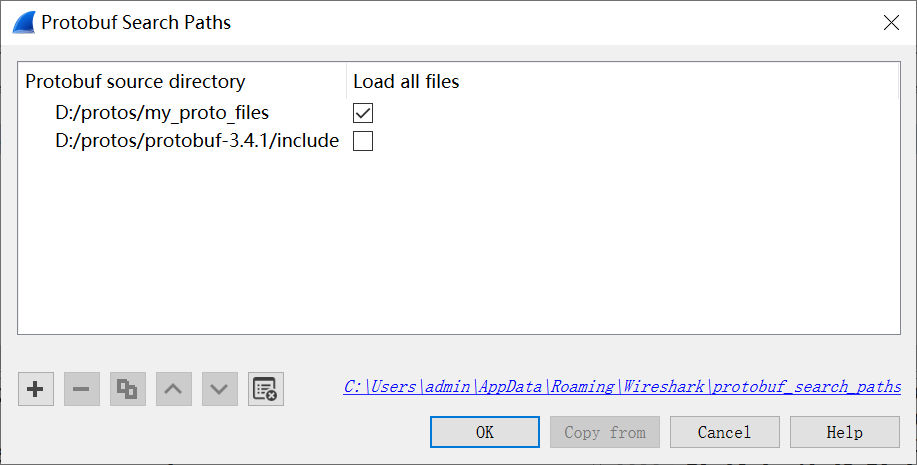
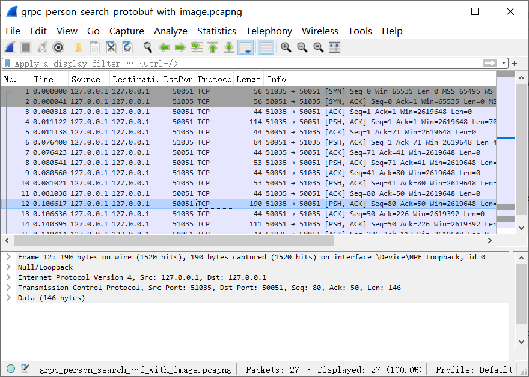
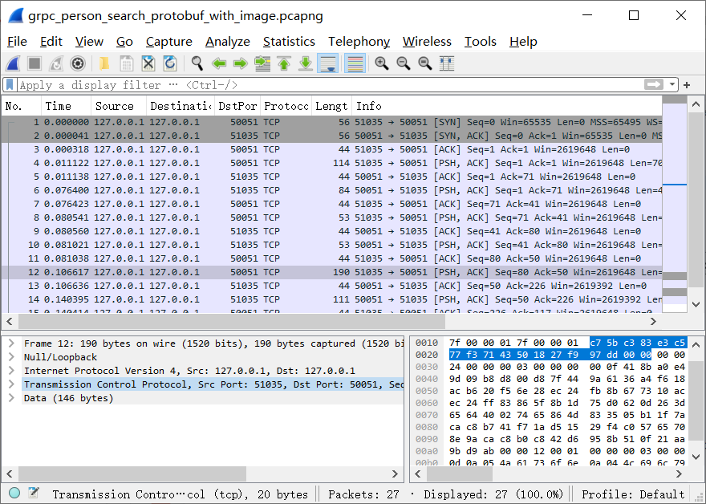
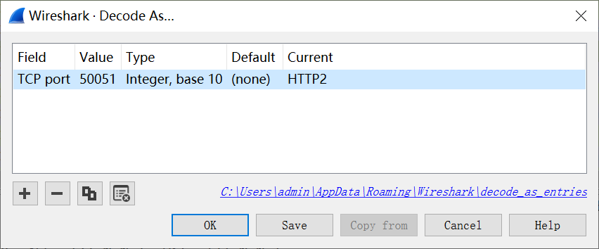
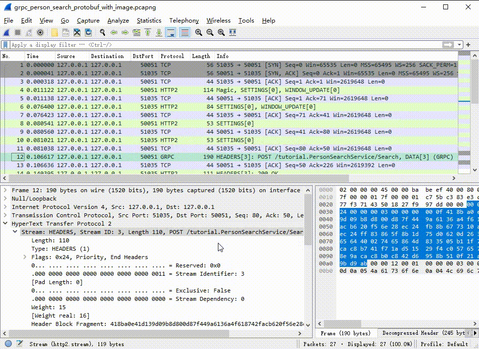
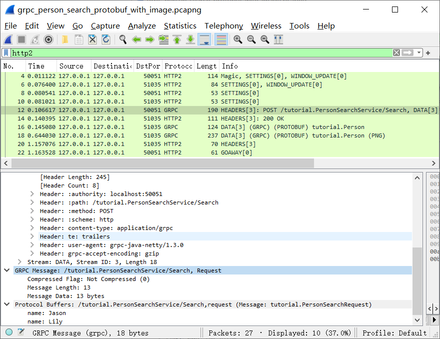
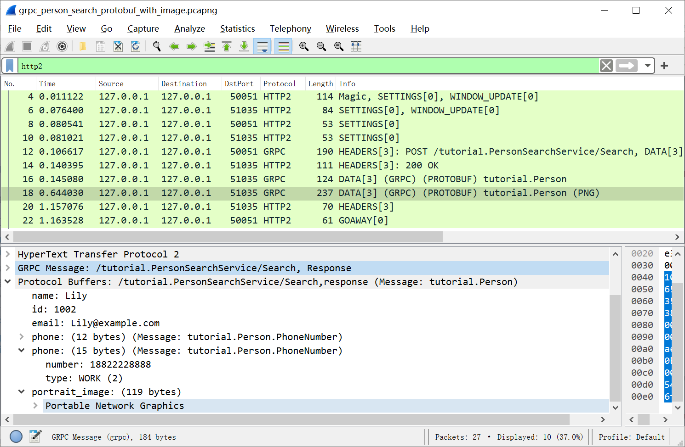

+++
title = "Analyzing gRPC messages using Wireshark"
date = 2024-11-19T11:35:00+08:00
weight = 110
type = "docs"
description = ""
isCJKLanguage = true
draft = false
+++

> 原文：[https://grpc.io/blog/wireshark/](https://grpc.io/blog/wireshark/)
>
> 收录该文档的时间：`2024-11-19T11:35:00+08:00`

# Analyzing gRPC messages using Wireshark

By [**Huang Qiangxiong**](https://github.com/huangqiangxiong) , [**Patrice Chalin (editor)**](https://github.com/chalin) | Wednesday, February 03, 2021


[Wireshark](https://www.wireshark.org/) is an open source network protocol analyzer that can be used for protocol development, network troubleshooting, and education. Wireshark lets you analyze gRPC messages that are transferred over the network, and learn about the binary format of these messages.

In this post, you’ll learn how to configure and use the Wireshark [gRPC dissector](https://gitlab.com/wireshark/wireshark/-/wikis/gRPC) and the [Protocol Buffers (Protobuf) dissector](https://gitlab.com/wireshark/wireshark/-/wikis/Protobuf), which are protocol-specific components that allow you to analyze gRPC messages with Wireshark.

## Features

The main features of the gRPC and Protobuf dissectors are the following:

- Support dissecting (decoding) gRPC messages serialized in the [protocol buffer wire format](https://developers.google.com/protocol-buffers/docs/encoding) or as JSON
- Support dissecting gRPC messages of unary, server streaming, client streaming, and bidirectional streaming RPC calls
- Enhanced dissection of serialized protocol buffers data by allowing you to do the following:
  - Load relevant `.proto` files
  - Register your own subdissectors for protocol buffer fields of type `byte` or `string`

## Capturing gRPC traffic

This post focuses on the analysis of captured gRPC messages. To learn how to store network traffic in *capture files*, see [Capturing Live Network Data](https://www.wireshark.org/docs/wsug_html_chunked/ChapterCapture.html) from the [Wireshark User’s Guide](https://www.wireshark.org/docs/wsug_html_chunked/).

#### Note

Currently, Wireshark can only parse **plain text** gRPC messages. While [Wireshark supports TLS dissection](https://gitlab.com/wireshark/wireshark/-/wikis/tls), it requires per-session secret keys. As of the time of writing, the only [Go gRPC]() supports the exporting such keys. To learn how to export keys using Go gRPC – and other languages as support becomes available – see [How to Export TLS Master keys of gRPC](https://gitlab.com/wireshark/wireshark/-/wikis/How-to-Export-TLS-Master-keys-of-gRPC).

## Example

Let’s walk through the setup necessary to analyze previously-captured messages that were generated by a slightly extended version of the *address book* app used in the [Protocol Buffers tutorials](https://developers.google.com/protocol-buffers/docs/tutorials).

### Address book `.proto` files

The app’s main protocol file is `addressbook.proto`:

```protobuf
syntax = "proto3";
package tutorial;
import "google/protobuf/timestamp.proto";

message Person {
  string name = 1;
  int32 id = 2;  // Unique ID number for this person.
  string email = 3;

  enum PhoneType {
    MOBILE = 0;
    HOME = 1;
    WORK = 2;
  }

  message PhoneNumber {
    string number = 1;
    PhoneType type = 2;
  }

  repeated PhoneNumber phone = 4;
  google.protobuf.Timestamp last_updated = 5;
  bytes portrait_image = 6;
}

message AddressBook {
  repeated Person people = 1;
}
```

This file is identical to the [Protocol Buffers tutorial version](https://github.com/protocolbuffers/protobuf/blob/master/examples/addressbook.proto), except for the additional `portrait_image` field.

Note the `import` statement at the top of the file, it is used to import `Timestamp`, which is one of many [Protocol Buffers Well-Known Types](https://developers.google.com/protocol-buffers/docs/reference/google.protobuf).

Our variant of the app also defines a *person-search* service that can be used to search for address book entries based on selected `Person` attributes. The service is defined in `person_search_service.proto`:

```protobuf
syntax = "proto3";
package tutorial;
import "addressbook.proto";

message PersonSearchRequest {
  repeated string name = 1;
  repeated int32 id = 2;
  repeated string phoneNumber = 3;
}

service PersonSearchService {
  rpc Search (PersonSearchRequest) returns (stream Person) {}
}
```

Because the service uses the `Person` type defined in `addressbook.proto`, the address book `.proto` is imported at the start of the file.

### Setting protobuf search paths

Wireshark gives the most meaningful decodings when it knows about the `.proto` files used by the apps whose messages you are analyzing.

You can tell Wireshark where to find `.proto` files by setting the **Protobuf Search Paths** in the preferences accessible from the **Edit** menu under **Preferences > Protocols > Protobuf**.

If our example app’s `.proto` files are in the `d:/protos/my_proto_files` directory, and the official Protobuf library directory is `d:/protos/protobuf-3.4.1/include`, then add these two paths as *source directories* like this:





By selecting the **Load all files** option for the app’s protocol directory you enable preloading of message definitions from the `addressbook.proto` and `person_search_service.proto` files.

### Loading a capture file

From the Wireshark [SampleCaptures page](https://gitlab.com/wireshark/wireshark/-/wikis/SampleCaptures), download the following sample gRPC capture file created by running the app and issuing a search request: [grpc_person_search_protobuf_with_image.pcapng](https://gitlab.com/wireshark/wireshark/-/wikis/uploads/f6fcdceb0248669c0b057bd15d45ab6f/grpc_person_search_protobuf_with_image.pcapng).

Select **Open** from the **File** menu to load the capture file in Wireshark. Wireshark displays, in order, all of the network traffic from the capture file in the **Packet-list pane** at the top of the window.

Select an entry from the packet-list pane and Wireshark will decode it and show its details in the lower pane like this:





Select an entry from the details pane to see the byte sequence corresponding to that entry:





### Setting port traffic type

The app’s server-side port is 50051. The client-side port, which is different for each RPC call, is 51035 in the sample capture file.

You need to tell Wireshark that these ports are carrying HTTP2 traffic. Do this through the **Decode As** dialog, which you access from the **Analyze** menu (or right-click on an entry from the packet-list pane). You only need to register the server-side port:





Look at the packet-list pane and you’ll see that Wireshark is now decoding HTTP2 and gRPC messages:





### Decoding the search request message

Select the first gRPC message sent to port 50051, it corresponds to the sample’s service request message. This is how Wireshark dissects the gRPC request:





By examining the HTTP2 message header `path` field, you’ll see the URL to the app’s service (`/tutorial.PersonSearchService`), followed by the name of the invoked RPC (`Search`).

The `content-type`, which is set by the gRPC library, informs Wireshark that the HTTP2 message content is a gRPC message. By examining the decoded Protocol Buffers message of the sample gRPC request, you can see that the search request is for the names “Jason” and “Lily”.

### Decoding the server-streamed response

Since the `Search` RPC response is server-streaming, `Person` objects can be returned to the client one after another.

Select the second `Person` message returned in the response stream to see its details:





By registering subdissectors, you can have Wireshark further decode fields of type `byte` or `string`. For example, to learn how to register a PNG decoder for the `portrait_image` field, see [Protobuf field subdissectors](https://gitlab.com/wireshark/wireshark/-/wikis/Protobuf#protobuf-field-subdissectors).

## History of gRPC and Protocol Buffers support

Here is a brief annotated list of Wireshark versions as they relate to the support of gRPC and Protocol Buffers:

- v2.6.0: first release of gRPC and Protobuf dissectors, without support for `.proto` files or streaming RPCs.
- v3.2.0: improved dissection of serialized protocol buffers data based on `.proto` files, and support of streaming RPCs.
- v3.3.0: improved and enhanced `.proto` file support, such as capture-file search on protocol buffer field values.
- v3.4.0: Protocol Buffers [Timestamp](https://developers.google.com/protocol-buffers/docs/reference/google.protobuf#google.protobuf.Timestamp) time is displayed as locale date-time string.

## Learn more

Interested in learning more? Start with the [Wireshark User’s Guide](https://www.wireshark.org/docs/wsug_html_chunked/). For more details concerning the example used in this post, as well as other sample capture files containing gRPC messages, see the [gRPC dissector](https://gitlab.com/wireshark/wireshark/-/wikis/gRPC) and [Protocol Buffers dissector](https://gitlab.com/wireshark/wireshark/-/wikis/Protobuf) wiki pages.
