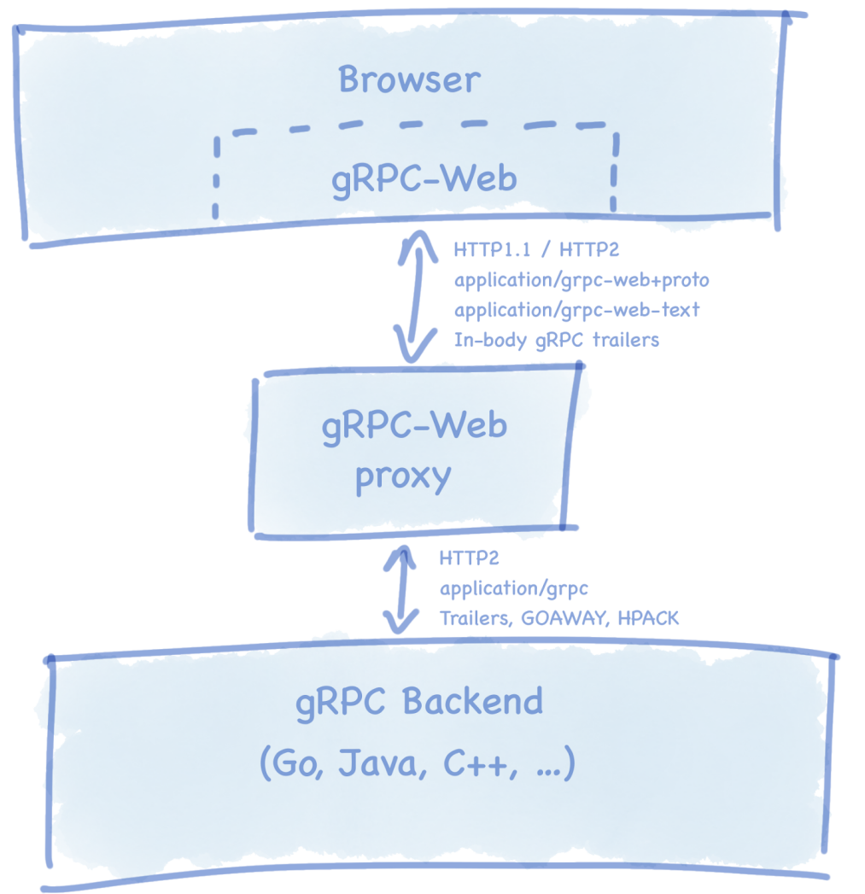

+++
title = "The state of gRPC in the browser"
date = 2024-11-19T11:35:00+08:00
weight = 190
type = "docs"
description = ""
isCJKLanguage = true
draft = false
+++

> 原文：[https://grpc.io/blog/state-of-grpc-web/](https://grpc.io/blog/state-of-grpc-web/)
>
> 收录该文档的时间：`2024-11-19T11:35:00+08:00`

# The state of gRPC in the browser

By [**Johan Brandhorst**](https://jbrandhorst.com/) (Software Engineer at [InfoSum](https://www.infosum.com/)) | **Guest post**
Tuesday, January 08, 2019

gRPC 1.0 was released in August 2016 and has since grown to become one of the premier technical solutions for application communications. It has been adopted by startups, enterprise companies, and open source projects worldwide. Its support for polyglot environments, focus on performance, type safety, and developer productivity has transformed the way developers design their architectures.

So far the benefits have largely only been available to mobile app and backend developers, whilst frontend developers have had to continue to rely on JSON REST interfaces as their primary means of information exchange. However, with the release of gRPC-Web, gRPC is poised to become a valuable addition in the toolbox of frontend developers.

In this post, I’ll describe some of the history of gRPC in the browser, explore the state of the world today, and share some thoughts on the future.

# Beginnings

In the summer of 2016, both a team at Google and Improbable[1](https://grpc.io/blog/state-of-grpc-web/#f1) independently started working on implementing something that could be called “gRPC for the browser”. They soon discovered each other’s existence and got together to define a spec[2](https://grpc.io/blog/state-of-grpc-web/#f2) for the new protocol.

## The gRPC-Web Spec

It is currently impossible to implement the HTTP/2 gRPC spec[3](https://grpc.io/blog/state-of-grpc-web/#f3) in the browser, as there is simply no browser API with enough fine-grained control over the requests. For example: there is no way to force the use of HTTP/2, and even if there was, raw HTTP/2 frames are inaccessible in browsers. The gRPC-Web spec starts from the point of view of the HTTP/2 spec, and then defines the differences. These notably include:

- Supporting both HTTP/1.1 and HTTP/2.
- Sending of gRPC trailers at the very end of request/response bodies as indicated by a new bit in the gRPC message header[4](https://grpc.io/blog/state-of-grpc-web/#f4).
- A mandatory proxy for translating between gRPC-Web requests and gRPC HTTP/2 responses.

## The Tech

The basic idea is to have the browser send normal HTTP requests (with Fetch or XHR) and have a small proxy in front of the gRPC server to translate the requests and responses to something the browser can use.

# The Two Implementations

The teams at Google and Improbable both went on to implement the spec in two different repositories[5](https://grpc.io/blog/state-of-grpc-web/#f5),[6](https://grpc.io/blog/state-of-grpc-web/#f6), and with slightly different implementations, such that neither entirely conformed to the spec, and for a long time neither was compatible with the other’s proxy[7](https://grpc.io/blog/state-of-grpc-web/#f7),[8](https://grpc.io/blog/state-of-grpc-web/#f8).

The Improbable gRPC-Web client[9](https://grpc.io/blog/state-of-grpc-web/#f9) is implemented in TypeScript and available on npm as `@improbable-eng/grpc-web`[10](https://grpc.io/blog/state-of-grpc-web/#f10). There is also a Go proxy available, both as a package that can be imported into existing Go gRPC servers[11](https://grpc.io/blog/state-of-grpc-web/#f11), and as a standalone proxy that can be used to expose an arbitrary gRPC server to a gRPC-Web frontend[12](https://grpc.io/blog/state-of-grpc-web/#f12).

The Google gRPC-Web client[13](https://grpc.io/blog/state-of-grpc-web/#f13) is implemented in JavaScript using the Google Closure library[14](https://grpc.io/blog/state-of-grpc-web/#f14) base. It is available on npm as `grpc-web`[15](https://grpc.io/blog/state-of-grpc-web/#f15). It originally shipped with a proxy implemented as an NGINX extension[16](https://grpc.io/blog/state-of-grpc-web/#f16), but has since doubled down on an Envoy proxy HTTP filter[17](https://grpc.io/blog/state-of-grpc-web/#f17), which is available in all versions since v1.4.0.

## Feature Sets

The gRPC HTTP/2 implementations all support the four method types: unary, server-side, client-side, and bi-directional streaming. However, the gRPC-Web spec does not mandate any client-side or bi-directional streaming support specifically, only that it will be implemented once WHATWG Streams[18](https://grpc.io/blog/state-of-grpc-web/#f18) are implemented in browsers.

The Google client supports unary and server-side streaming, but only when used with the `grpcwebtext` mode. Only unary requests are fully supported in the `grpcweb` mode. These two modes specify different ways to encode the protobuf payload in the requests and responses.

The Improbable client supports both unary and server-side streaming, and has an implementation that automatically chooses between XHR and Fetch based on the browser capabilities.

Here’s a table that summarizes the different features supported:

| Client / Feature       | Transport  | Unary | Server-side streams                                | Client-side & bi-directional streaming             |
| ---------------------- | ---------- | ----- | -------------------------------------------------- | -------------------------------------------------- |
| Improbable             | Fetch/XHR ️ | ✔️     | ✔️                                                  | ❌[19](https://grpc.io/blog/state-of-grpc-web/#f19) |
| Google (`grpcwebtext`) | XHR ️       | ✔️     | ✔️                                                  | ❌                                                  |
| Google (`grpcweb`)     | XHR ️       | ✔️     | ❌[20](https://grpc.io/blog/state-of-grpc-web/#f20) | ❌                                                  |

For more information on this table, please see [my compatibility test repo on github](https://github.com/johanbrandhorst/grpc-web-compatibility-test).

The compatibility tests may evolve into some automated test framework to enforce and document the various compatibilities in the future.

## Compatibility Issues

Of course, with two different proxies also come compatibility issues. Fortunately, these have recently been ironed out, so you can expect to use either client with either proxy.

# The Future

The Google implementation announced version 1.0 and general availability in October 2018[21](https://grpc.io/blog/state-of-grpc-web/#f21) and has published a road map of future goals[22](https://grpc.io/blog/state-of-grpc-web/#f22), including:

- An efficient JSON-like message encoding
- In-process proxies for Node, Python, Java and more
- Integration with popular frameworks (React, Angular, Vue)
- Fetch API transport for memory efficient streaming
- Bi-directional streaming support

Google is looking for feedback on what features are important to the community, so if you think any of these are particularly valuable to you, then please fill in their survey[23](https://grpc.io/blog/state-of-grpc-web/#f23).

Recent talks between the two projects have agreed on promoting the Google client and Envoy proxy as preferred solutions for new users. The Improbable client and proxy will remain as alternative implementations of the spec without the Google Closure dependency, but should be considered experimental. A migration guide will be produced for existing users to move to the Google client, and the teams are working together to converge the generated APIs.

# Conclusion

The Google client will continue to have new features and fixes implemented at a steady pace, with a team dedicated to its success, and it being the official gRPC client. It doesn’t have Fetch API support like the Improbable client, but if this is an important feature for the community, it will be added. The Google team and the greater community are collaborating on the official client to the benefit of the gRPC community at large. Since the GA announcement the community contributions to the Google gRPC-Web repo has increased dramatically.

When choosing between the two proxies, there’s no difference in capability, so it becomes a matter of your deployment model. Envoy will suit some scenarios, while an in-process Go proxy has its own advantages.

If you’re getting started with gRPC-Web today, first try the Google client. It has strict API compatibility guarantees and is built on the rock-solid Google Closure library base used by Gmail and Google Maps. If you *need* Fetch API memory efficiency or experimental websocket client-side and bi-directional streaming, the Improbable client is a good choice, and it will continue to be used and maintained by Improbable for the foreseeable future.

Either way, gRPC-Web is an excellent choice for web developers. It brings the portability, performance, and engineering of a sophisticated protocol into the browser, and marks an exciting time for frontend developers!

## References

1. [improbable.io/games/blog/grpc-web-moving-past-restjson-towards-type-safe-web-apis](https://improbable.io/games/blog/grpc-web-moving-past-restjson-towards-type-safe-web-apis) [↩](https://grpc.io/blog/state-of-grpc-web/#a1)
2. [github.com/grpc/grpc/blob/master/doc/PROTOCOL-WEB.md](https://github.com/grpc/grpc/blob/master/doc/PROTOCOL-WEB.md) [↩](https://grpc.io/blog/state-of-grpc-web/#a2)
3. [github.com/grpc/grpc/blob/master/doc/PROTOCOL-HTTP2.md](https://github.com/grpc/grpc/blob/master/doc/PROTOCOL-HTTP2.md) [↩](https://grpc.io/blog/state-of-grpc-web/#a3)
4. [github.com/grpc/grpc/blob/master/doc/PROTOCOL-WEB.md#protocol-differences-vs-grpc-over-http2](https://github.com/grpc/grpc/blob/master/doc/PROTOCOL-WEB.md#protocol-differences-vs-grpc-over-http2) [↩](https://grpc.io/blog/state-of-grpc-web/#a4)
5. [github.com/improbable-eng/grpc-web](https://github.com/improbable-eng/grpc-web) [↩](https://grpc.io/blog/state-of-grpc-web/#a5)
6. [github.com/grpc/grpc-web](https://github.com/grpc/grpc-web) [↩](https://grpc.io/blog/state-of-grpc-web/#a6)
7. [github.com/improbable-eng/grpc-web/issues/162](https://github.com/improbable-eng/grpc-web/issues/162) [↩](https://grpc.io/blog/state-of-grpc-web/#a7)
8. [github.com/grpc/grpc-web/issues/91](https://github.com/grpc/grpc-web/issues/91) [↩](https://grpc.io/blog/state-of-grpc-web/#a8)
9. [github.com/improbable-eng/grpc-web/tree/master/client/grpc-web](https://github.com/improbable-eng/grpc-web/tree/master/client/grpc-web) [↩](https://grpc.io/blog/state-of-grpc-web/#a9)
10. [npmjs.com/package/@improbable-eng/grpc-web](https://www.npmjs.com/package/@improbable-eng/grpc-web) [↩](https://grpc.io/blog/state-of-grpc-web/#a10)
11. [github.com/improbable-eng/grpc-web/tree/master/go/grpcweb](https://github.com/improbable-eng/grpc-web/tree/master/go/grpcweb) [↩](https://grpc.io/blog/state-of-grpc-web/#a11)
12. [github.com/improbable-eng/grpc-web/tree/master/go/grpcwebproxy](https://github.com/improbable-eng/grpc-web/tree/master/go/grpcwebproxy) [↩](https://grpc.io/blog/state-of-grpc-web/#a12)
13. [github.com/grpc/grpc-web/tree/master/javascript/net/grpc/web](https://github.com/grpc/grpc-web/tree/master/javascript/net/grpc/web) [↩](https://grpc.io/blog/state-of-grpc-web/#a13)
14. [developers.google.com/closure](https://developers.google.com/closure) [↩](https://grpc.io/blog/state-of-grpc-web/#a14)
15. [npmjs.com/package/grpc-web](https://www.npmjs.com/package/grpc-web) [↩](https://grpc.io/blog/state-of-grpc-web/#a15)
16. [github.com/grpc/grpc-web/tree/master/net/grpc/gateway](https://github.com/grpc/grpc-web/tree/master/net/grpc/gateway) [↩](https://grpc.io/blog/state-of-grpc-web/#a16)
17. [envoyproxy.io/docs/envoy/latest/configuration/http/http_filters/grpc_web_filter](https://www.envoyproxy.io/docs/envoy/latest/configuration/http/http_filters/grpc_web_filter) [↩](https://grpc.io/blog/state-of-grpc-web/#a17)
18. [streams.spec.whatwg.org](https://streams.spec.whatwg.org/) [↩](https://grpc.io/blog/state-of-grpc-web/#a18)
19. The Improbable client supports client-side and bi-directional streaming with an experimental websocket transport. This is not part of the gRPC-Web spec, and is not recommended for production use. [↩](https://grpc.io/blog/state-of-grpc-web/#a19)
20. `grpcweb` allows server streaming methods to be called, but it doesn’t return data until the stream has closed. [↩](https://grpc.io/blog/state-of-grpc-web/#a20)
21. [gRPC-Web is Generally Available]() [↩](https://grpc.io/blog/state-of-grpc-web/#a21)
22. [github.com/grpc/grpc-web/blob/master/doc/roadmap.md](https://github.com/grpc/grpc-web/blob/master/doc/roadmap.md) [↩](https://grpc.io/blog/state-of-grpc-web/#a22)
23. [docs.google.com/forms/d/1NjWpyRviohn5jaPntosBHXRXZYkh_Ffi4GxJZFibylM](https://docs.google.com/forms/d/1NjWpyRviohn5jaPntosBHXRXZYkh_Ffi4GxJZFibylM) [↩](https://grpc.io/blog/state-of-grpc-web/#a23)

