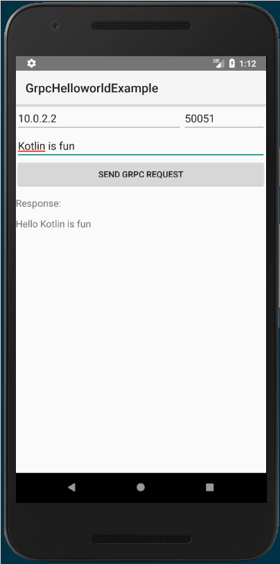

+++
title = "gRPC ❤ Kotlin"
date = 2024-11-19T11:35:00+08:00
weight = 280
type = "docs"
description = ""
isCJKLanguage = true
draft = false
+++

> 原文：[https://grpc.io/blog/kotlin-gradle-projects/](https://grpc.io/blog/kotlin-gradle-projects/)
>
> 收录该文档的时间：`2024-11-19T11:35:00+08:00`

# gRPC ❤ Kotlin

By [**Spencer Fang**](https://github.com/zpencer) | Tuesday, June 19, 2018


Did you know that gRPC Java now has out of box support for Kotlin projects built with Gradle? [Kotlin](https://kotlinlang.org/) is a modern, statically typed language developed by JetBrains that targets the JVM and Android. It is generally easy for Kotlin programs to interoperate with existing Java libraries. To improve this experience further, we have added support to the [protobuf-gradle-plugin](https://github.com/google/protobuf-gradle-plugin/releases) so that the generated Java libraries are automatically picked up by Kotlin. You can now add the protobuf-gradle-plugin to your Kotlin project, and use gRPC just like you would with a typical Java project.

#### Native Kotlin support

Looking for native Kotlin support of gRPC? See [Kotlin, meet gRPC]().

The following examples show you how to configure a project for a JVM application and an Android application using Kotlin.

### Kotlin gRPC client and server

The full example can be found [here](https://github.com/grpc/grpc-java/tree/v1.29.0/examples/example-kotlin).

Configuring gRPC for a Kotlin project is the same as configuring it for a Java project.

Below is a snippet of the example project’s `build.gradle` highlighting some Kotlin related sections:

```groovy
apply plugin: 'kotlin'
apply plugin: 'com.google.protobuf'

// Generate IntelliJ IDEA's .idea & .iml project files.
// protobuf-gradle-plugin automatically registers *.proto and the gen output files
// to IntelliJ as sources.
// For best results, install the Protobuf and Kotlin plugins for IntelliJ.
apply plugin: 'idea'

buildscript {
  ext.kotlin_version = '1.2.21'

  repositories {
    mavenCentral()
  }
  dependencies {
    classpath 'com.google.protobuf:protobuf-gradle-plugin:0.8.5'
    classpath "org.jetbrains.kotlin:kotlin-gradle-plugin:$kotlin_version"
  }
}

dependencies {
  compile "org.jetbrains.kotlin:kotlin-stdlib-jdk8:$kotlin_version"
  // The rest of the projects dep are added below, refer to example URL
}

// The standard protobuf block, same as normal gRPC Java projects
protobuf {
  protoc { artifact = 'com.google.protobuf:protoc:3.5.1-1' }
    plugins {
      grpc { artifact = "io.grpc:protoc-gen-grpc-java:${grpcVersion}" }
    }
    generateProtoTasks {
      all()*.plugins { grpc {} }
    }
}
```

Now Kotlin source files can use the proto generated messages and gRPC stubs. By default, Kotlin sources should be placed in `src/main/kotlin` and `src/test/kotlin`. If needed, run `./gradlew generateProto generateTestProto` and refresh IntelliJ for the generated sources to appear in the IDE. Finally, run `./gradlew installDist` to build the project, and use `./build/install/examples/bin/hello-world-client` or `./build/install/examples/bin/hello-world-server` to run the example.

You can read more about configuring Kotlin [here](https://kotlinlang.org/docs/reference/using-gradle.html).

### Kotlin Android gRPC application

The full example can be found [here](https://github.com/grpc/grpc-java/tree/v1.29.0/examples/example-kotlin/android/helloworld).

Configuring gRPC for a Kotlin Android project is the same as configuring it for a normal Android project.

In the top level `build.gradle` file:

```groovy
buildscript {
  ext.kotlin_version = '1.2.21'

  repositories {
    google()
    jcenter()
  }
  dependencies {
    classpath 'com.android.tools.build:gradle:3.0.1'
    classpath "com.google.protobuf:protobuf-gradle-plugin:0.8.5"
    classpath "org.jetbrains.kotlin:kotlin-gradle-plugin:$kotlin_version"
  }
}

allprojects {
  repositories {
    google()
    jcenter()
  }
}
```

And in the app module’s `build.gradle` file:

```groovy
apply plugin: 'com.android.application'
apply plugin: 'kotlin-android'
apply plugin: 'kotlin-android-extensions'
apply plugin: 'com.google.protobuf'

repositories {
  mavenCentral()
}

dependencies {
  compile "org.jetbrains.kotlin:kotlin-stdlib-jdk7:$kotlin_version"
  // refer to full example for remaining deps
}

protobuf {
  // The normal gRPC configuration for Android goes here
}

android {
  // Android Studio 3.1 does not automatically pick up 'src/main/kotlin' as source files
  sourceSets {
    main.java.srcDirs += 'src/main/kotlin'
  }
}
```

Just like the non-Android project, run `./gradlew generateProto generateProto` to run the proto code generator and `./gradlew build` to build the project.

Finally, test out the Android app by opening the project in Android Studio and selecting `Run > Run 'app'`.





We are excited about improving the gRPC experience for Kotlin developers. Please add enhancement ideas or bugs to the [protobuf-gradle-plugin issue tracker](https://github.com/google/protobuf-gradle-plugin/issues) or the [grpc-java issue tracker](https://github.com/grpc/grpc-java/issues).
