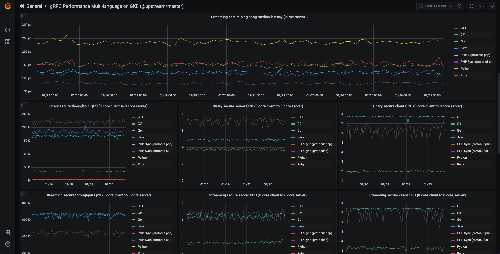

+++
title = "gRPC performance benchmarks on GKE"
date = 2024-11-19T11:35:00+08:00
weight = 80
type = "docs"
description = ""
isCJKLanguage = true
draft = false
+++

> 原文：[https://grpc.io/blog/performance-benchmarks-gke/](https://grpc.io/blog/performance-benchmarks-gke/)
>
> 收录该文档的时间：`2024-11-19T11:35:00+08:00`

# gRPC performance benchmarks on GKE

By [**Paulo Castello da Costa**](https://github.com/paulosjca) , [**Jan Tattermusch**](https://github.com/jtattermusch) | Tuesday, March 01, 2022

[gRPC performance benchmarks](https://grpc.io/docs/guides/benchmarking) have now been transitioned to run on GKE, with similar results but much increased flexibility.

## Background

gRPC performance testing requires a test driver and workers (one or more clients and a server), as described in [gRPC performance benchmarks](https://grpc.io/docs/guides/benchmarking). Each test may have a different configuration, or *scenario*, that is passed to the driver and specified as a JSON file. Previously, the driver was run by the continuous integration process, and the workers were run on long-lived GCE VMs. This gave rise to several limitations:

1. Tests ran sequentially and were difficult to parallelize, since they ran on (the same) fixed VMs.
2. The state of the VMs was not guaranteed to be the same at the start of each test.
3. Running manual experiments required configuring new VMs, which was a manual process, or reusing existing VMs, with the risks of collision with other users and of having VMs in an unknown state.

## Benchmarking on Kubernetes

The core of the current framework is a [custom controller](https://github.com/grpc/test-infra/blob/master/cmd/controller/main.go) for managing Kubernetes resources of kind [LoadTest](https://github.com/grpc/test-infra/blob/master/config/crd/bases/e2etest.grpc.io_loadtests.yaml). This controller must be deployed to a Kubernetes cluster before load tests can be run on it. The controller is implemented with [kubebuilder](https://kubebuilder.io/). The code for the controller is stored in the [Test Infra](https://github.com/grpc/test-infra) repository. For further documentation on individual LoadTest fields, see the [LoadTest implementation](https://github.com/grpc/test-infra/blob/master/api/v1/loadtest_types.go).

LoadTest configurations specify driver, client and server pods to be created for the test. Once the configuration is applied to the cluster (for instance, with `kubectl apply -f`), the controller will create the pods and the test will run. If multiple configurations are applied to the cluster, the controller will create pods as long as there are resources available, allowing tests to run in parallel.

[Examples](https://github.com/grpc/test-infra/blob/master/config/samples/README.md) include basic configurations that can be applied directly, and templates that require additional steps and parameter substitution.

- Basic configurations rely on **clone**, **build** and **runtime** worker images that are bundled with each release of the controller. The clone and build images are used to build gRPC binaries that are passed to the runtime container. These configurations are suitable as examples and for one-off testing.
- Template configurations rely on worker images that are built before starting the tests. These **prebuilt images** include the gRPC binary, eliminating the need to clone and build before each test. Template substitution is used to point to the location of the worker images. These configurations are suitable for running a batch of tests on the same gRPC version, or for running the same test repeatedly.

In addition to the controller, the [Test Infra](https://github.com/grpc/test-infra) repository contains a set of [tools](https://github.com/grpc/test-infra/blob/master/tools/README.md), including a test runner and tools to build and delete prebuilt worker images, as well as a [dashboard](https://grpc.io/blog/performance-benchmarks-gke/#dashboard) implementation.

The tools related to prebuilt workers use `gcloud` internally and are dependent on GKE. Other than that, all components of the framework are built on Kubernetes itself and independent of GKE. That is, it should be possible to deploy the controller and run tests on a custom Kubernetes cluster or on another cloud provider’s Kubernetes offering.

## Cluster setup

The cluster running benchmark jobs must be configured with node pools dimensioned for the number of simultaneous tests that it should support. The controller uses `pool` as a node selector for the various pod types. Worker pods have mutual anti-affinity, so one node is required per pod.

For example, the node pools that are used in our continuous integration setup are configured as follows:

| Pool name            | Node count | Machine type   | Kubernetes labels                     |
| :------------------- | ---------: | :------------- | :------------------------------------ |
| system               |          2 | e2-standard-8  | default-system-pool:true, pool:system |
| drivers-ci           |          8 | e2-standard-2  | pool:drivers-ci                       |
| workers-c2-8core-ci  |          8 | c2-standard-8  | pool:workers-c2-8core-ci              |
| workers-c2-30core-ci |          8 | c2-standard-30 | pool:workers-c2-30core-ci             |

Since each scenario in our tests requires one driver and two workers, this configuration supports four simultaneous tests on 8-core machines and four on 30-core machines. Drivers require few resources, and do not have mutual anti-affinity. We find it convenient to schedule them on two-core machines with a node count set to the required number of drivers, rather than on a larger shared machine, because that allows the driver pool to be resized together with the worker pools. The controller itself is scheduled in the `system` pool.

In addition to the pools used in continuous integration, our cluster contains additional node pools that can be used for ad hoc testing:

| Pool name      | Node count | Machine type   | Kubernetes labels                            |
| :------------- | ---------: | :------------- | :------------------------------------------- |
| drivers        |          8 | e2-standard-8  | default-driver-pool:true, pool:drivers       |
| workers-8core  |          8 | e2-standard-8  | default-worker-pool:true, pool:workers-8core |
| workers-32core |          8 | e2-standard-32 | pool:workers-32core                          |

Some pools are labeled with `default-*-pool` labels. These labels specify which pool to use if it is not specified in the LoadTest configuration. With the configuration above, these tests (for instance, the tests specified in the [examples](https://github.com/grpc/test-infra/blob/master/config/samples/README.md)) will use the `drivers` and `workers-8core` pools, and not interfere with continuous integration jobs. The default labels are defined as part of the controller build: if they are not set, the controller will only run tests where the `pool` labels are specified explicitly.

## Controller deployment

The steps for building and deploying a controller are described in the [deployment documentation](https://github.com/grpc/test-infra/blob/master/doc/deployment.md).

## Continuous integration

Our continuous integration setup is described in the [gRPC OSS benchmarks README](https://github.com/grpc/grpc/blob/master/tools/run_tests/performance/README.md#grpc-oss-benchmarks) in the [gRPC Core](https://github.com/grpc/grpc) repository. The main continuous integration job uses the script [grpc_e2e_performance_gke.sh](https://github.com/grpc/grpc/blob/master/tools/internal_ci/linux/grpc_e2e_performance_gke.sh) to generate the data presented on the dashboard linked to the [gRPC performance benchmarks](https://grpc.io/docs/guides/benchmarking) page.

Each continuous integration run has three phases:

1. Generate test configurations.
2. Build and push worker images.
3. Run the tests.

Each continuous integration run executes 122 tests using the 8-core worker pool, and 98 test using the 30-core worker pool. Each test runs one test scenario. Tests using C++, C#, Java and Python workers run on both pools. Tests using Node.js, PHP and Ruby workers run only on the 8-core pool. [Config generation](https://grpc.io/blog/performance-benchmarks-gke/#config-generation) for all these combinations takes negligible time (~1s).

The configurations used in continuous integration require worker images that include the gRPC binaries to be tested. These images depend only on the worker’s language, so these [prebuilt images](https://grpc.io/blog/performance-benchmarks-gke/#prebuilt-images) are built in advance and pushed to an image repository. This process takes approximately 20 minutes.

A [test runner](https://grpc.io/blog/performance-benchmarks-gke/#test-runner) manages the rate at which tests are applied to the cluster, collects test results and logs, and deletes tests once they complete successfully. Two tests at a time are allowed to run on each pool. This phase takes approximately 50 minutes to complete.

Each test scenario is configured to take 30s to run, plus a 5s warm-up period (15s for Java). This places a lower bound on the time needed to run each test. The observed run time of the 122 tests in the 8-core pool (16 of them in Java), running two tests at a time, implies that the overhead introduced by pod creation and deletion is modest, at ~12.8s per test.

### Config generation

Since we are running hundreds of tests that mostly share the same components (driver and workers for the various languages), it becomes necessary to generate configurations that includes repetitive driver and worker configurations and differ only in the scenario being tested. In addition, each configuration must have a unique name, since that is a requirement for resources applied to a Kubernetes cluster.

We handle these issues by [generating load test configurations](https://github.com/grpc/grpc/blob/master/tools/run_tests/performance/README.md#generating-load-test-configurations) with a tool. The tool is stored in the [gRPC Core](https://github.com/grpc/grpc) repository, where test scenarios are also defined.

### Prebuilt images

The configurations generated for continuous integration use a set of prebuilt images. These images are built and pushed to an image repository before running tests. The images are deleted at the end of each test run.

For details on the tools used to prepare and delete images, see [Using prebuilt images with gRPC OSS benchmarks](https://github.com/grpc/test-infra/blob/master/tools/README.md#using-prebuilt-images-with-grpc-oss-benchmarks).

### Test runner

The [test runner](https://github.com/grpc/test-infra/blob/master/tools/README.md#test-runner) takes the test configurations generated previously, applies each configuration to the cluster, polls each LoadTest resource for completion, collects artifacts such as results and pod logs, and (optionally) deletes resources once each test completes successfully.

The test runner maintains separate *queues* for tests that require the same resources on the cluster (e.g. 8-core or 30-core worker nodes). Tests configurations belonging to the same queue are not applied ot the cluster at once, but according to a *concurrency level* set for each queue. Our continuous integration tests run in two queues (corresponding to 8-core and 30-core worker nodes). The concurrency level of each queue is set to two.

Once a configuration is applied to the cluster, the controller creates client, driver and server pods to run the test, monitors test execution, and updates the status of the LoadTest resource.

The design of the test runner can be explained as follows:

1. The use of the test runner allows the continuous integration job to wait for all tests to complete, collect tests artifacts, and prepare a report with results.
2. The use of separate queues (indicated by annotations in each test configuration) allows tests that do not require the same cluster resources to be managed independently of each other.
3. The use of limited concurrency levels reduces the number of tests applied to the cluster at a time. This has several benefits:
   1. The load on the test runner is reduced, since there are fewer LoadTest resources on the cluster at a time, and the runner polls these resources periodically for completion. The polling interval in our continuous integration is set to 5s.
   2. The load on the controller is reduced, since there are fewer LoadTest resources at a time for it to control.
   3. Each test can have a shorter timeout period, since the time takes for the controller to start each test is more predictable. Timeouts are necessary to account for error cases where client or server pods hang and prevent the test from completing. These cases are rare but can accumulate and consume cluster resources, preventing other tests from running. Tests in our continuous integration have a timeout of 15 minutes.
   4. The concurrency level can be set lower than the capacity of the cluster, allowing a user to run a batch of tests without preventing other users from running tests simultaneously.
4. The option of deleting each test once it completes successfully (and after results and logs are collected) provides better control of the lifecycle of each test.
   1. The default behavior of the controller is to keep a LoadTest resource and associated pods on the cluster until it reaches a set TTL, and then delete it. Our continuous integration specifies a TTL of 24h for each test.
   2. Pods belonging to a completed LoadTest are in terminated state, and so consume no resources on the cluster. However, terminated pods can be garbage-collected at any time.
   3. If we let pods belonging to all completed tests stay in our continuous integration cluster, we find that they are garbage-collected within one hour.
   4. If we delete LoadTest resources for tests that complete successfully, the associated pods are also deleted. In this case, the pods belonging to *unsuccessful* tests, which are few in number and may be useful for debugging, stay on the cluster until the 24h TTL is reached.

### Dashboard

Test results from continuous integration are saved to [BigQuery](https://cloud.google.com/bigquery). The data stored in BigQuery is then replicated to a Postgres database for visualization on a dashboard.

The code for the dashboard, as well as the configuration of the main continuous integration dashboard, are stored in the [Test Infra](https://github.com/grpc/test-infra) repository. This brings the following benefits:

1. The main dashboard is maintained by updating the stored configuration, instead of updating it directly in the UI.
2. Users can deploy their own dashboard, using their own configuration.

This contrasts with the dashboard for the previous benchmarks, built using Perfkit Explorer, which was maintained by updating it directly in the UI, and could not be easily replicated by users.

For details, see [dashboard implementation](https://github.com/grpc/test-infra/tree/master/dashboard/README.md).

## Results

The following observations can be made on the results and user experience of the gRPC benchmarking on GKE:

1. Performance metrics (latency, QPS, etc.) produce the same or better results as the old benchmarks on GCE.
2. The overhead of pod creation and deletion for each test in GKE is small (less than 15s) in our benchmarking cluster.
3. Test images are dockerized and started again for each test, resulting in several benefits:
   1. Results are more consistent.
   2. Runtime errors are rare.
   3. System is split into well-defined components, resulting in simpler upgrades.
   4. Tests can be easily parallelized, resulting in faster execution times.
   5. Experiments are easier to perform.

Examples of best practices and insights derived from experimentation:

1. Use `c2` instances for clients and servers (instance types matter a lot for the observed latency and its variance and also for the measured throughput).
2. GKE pod-to-pod networking only has a very small overhead over raw GCE networking. You can get raw GCE networking performance by setting `hostnetworking:true` for the benchmark pods.
3. For Java under Docker, the JVM may not be able to detect the number of available processors automatically. This can lead to very pessimistic results, since gRPC uses the detected number of processors for sizing thread pools for processing events. A workaround is to set the number of processors explicitly. This workaround is implemented [here](https://github.com/grpc/test-infra/pull/231).

## Running your own

The code in the [Test Infra](https://github.com/grpc/test-infra) repository allows any user to create a cluster, deploy a controller, run gRPC benchmarks, and display results on their own dashboards. If you are interested in performance, and run your own benchmarks, [let us know!](https://groups.google.com/g/grpc-io)
