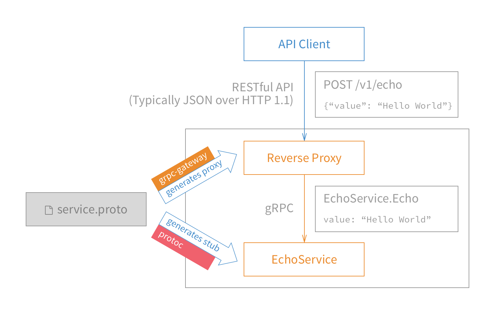
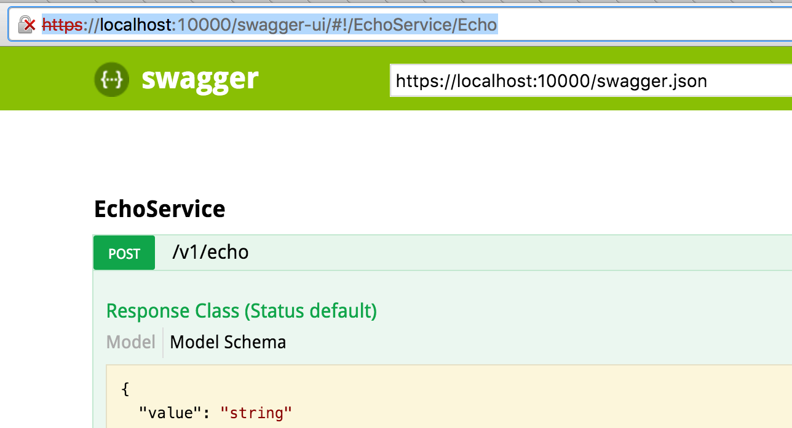

+++
title = "gRPC with REST and Open APIs"
date = 2024-11-19T11:35:00+08:00
weight = 450
type = "docs"
description = ""
isCJKLanguage = true
draft = false
+++

> 原文：[https://grpc.io/blog/coreos/](https://grpc.io/blog/coreos/)
>
> 收录该文档的时间：`2024-11-19T11:35:00+08:00`

# gRPC with REST and Open APIs

By **Brandon Phillips** ([CoreOS](https://coreos.com/)) | From this [original post](https://coreos.com/blog/grpc-protobufs-swagger.html), revised by Brandon Phillips, with additional content by Lisa Carey and others at Google.
Monday, May 09, 2016


Our guest post today comes from Brandon Phillips of [CoreOS](https://coreos.com/). CoreOS builds open source projects and products for Linux Containers. Their flagship product for consensus and discovery [etcd](https://coreos.com/etcd/) and their container engine [rkt](https://coreos.com/rkt/) are early adopters of gRPC.

One of the key reasons CoreOS chose gRPC is because it uses HTTP/2, enabling applications to present both a HTTP 1.1 REST/JSON API and an efficient gRPC interface on a single TCP port (available for Go). This provides developers with compatibility with the REST web ecosystem, while advancing a new, high-efficiency RPC protocol. With the recent release of Go 1.6, Go ships with a stable `net/http2` package by default.

Since many CoreOS clients speak HTTP 1.1 with JSON, gRPC’s easy interoperability with JSON and the [Open API Specification](https://github.com/OAI/OpenAPI-Specification) (formerly Swagger) was extremely valuable. For their users who are more comfortable with HTTP/1.1+JSON-based and Open API Spec APIs they used a combination of open source libraries to make their gRPC services available in both gRPC and HTTP REST flavors, using API multiplexers to give users the best of both worlds. Let’s dive into the details and find out how they did it!

## A gRPC application called EchoService

In this post we will build a small proof-of-concept gRPC application from a gRPC API definition, add a REST service gateway, and finally serve it all on a single TLS port. The application is called EchoService, and is the web equivalent of the shell command echo: the service returns, or “echoes”, whatever text is sent to it.

First, let’s define the arguments to EchoService in a protobuf message called EchoMessage, which includes a single field called value. We will define this message in a protobuf “.proto” file called `service.proto`. Here is our EchoMessage:

```proto
message EchoMessage {
 string value = 1;
}
```

In this same .proto file, we define a gRPC service that takes this data structure and returns it:

```proto
service EchoService {
  rpc Echo(EchoMessage) returns (EchoMessage) {
  }
}
```

Running this `service.proto` file “as is” through the Protocol Buffer compiler `protoc` generates a stub gRPC service in Go, along with clients in various languages. But gRPC alone isn’t as useful as a service that also exposes a REST interface, so we won’t stop with the gRPC service stub.

Next, we add the gRPC REST Gateway. This library will build a RESTful proxy on top of the gRPC EchoService. To build this gateway, we add metadata to the EchoService .proto to indicate that the Echo RPC maps to a RESTful POST method with all RPC parameters mapped to a JSON body. The gateway can map RPC parameters to URL paths and query parameters, but we omit those complications here for brevity.

```proto
service EchoService {
  rpc Echo(EchoMessage) returns (EchoMessage) {
    option (google.api.http) = {
      post: "/v1/echo"
      body: "*"
    };
  }
}
```

This means the gateway, once generated by `protoc`, can now accept a HTTP request from `curl` like this:

```sh
$ curl -X POST -k https://localhost:10000/v1/echo -d '{"value": "CoreOS is hiring!"}'
```

The whole system so far looks like this, with a single `service.proto` file generating both a gRPC server and a REST proxy:



To bring this all together, the echo service creates a Go `http.Handler` to detect if the protocol is HTTP/2 and the Content-Type is “application/grpc”, and sends such requests to the gRPC server. Everything else is routed to the REST gateway. The code looks something like this:

```go
if r.ProtoMajor == 2 && strings.Contains(r.Header.Get("Content-Type"), "application/grpc") {
	grpcServer.ServeHTTP(w, r)
} else {
	otherHandler.ServeHTTP(w, r)
}
```

To try it out, all you need is a working Go 1.6 development environment and the following simple commands:

```sh
$ go get -u github.com/philips/grpc-gateway-example
$ grpc-gateway-example serve
```

With the server running you can try requests on both HTTP 1.1 and gRPC interfaces:

```sh
$ grpc-gateway-example echo Take a REST from REST with gRPC
$ curl -X POST -k https://localhost:10000/v1/echo -d '{"value": "CoreOS is hiring!"}'
```

One last bonus: because we have an Open API specification, you can browse the Open API UI running at `https://localhost:10000/swagger-ui/#!/EchoService/Echo` if you have the server above running on your laptop.



We’ve taken a look at how to use gRPC to bridge to the world of REST. If you want to take a look at the complete project, check out the [repo on GitHub](https://github.com/philips/grpc-gateway-example). We think this pattern of using a single protobuf to describe an API leads to an easy to consume, flexible API framework, and we’re excited to leverage it in more of our projects.
