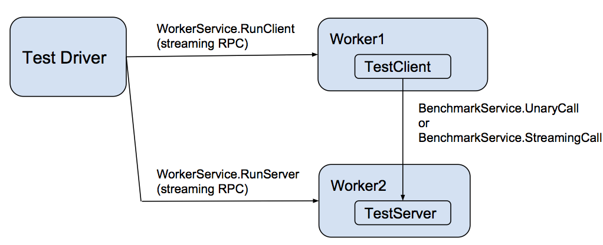

+++
title = "基准测试"
date = 2024-11-19T10:19:42+08:00
weight = 10
type = "docs"
description = "gRPC 被设计为支持多语言的高性能开源 RPC。本页介绍性能基准测试工具、测试所考虑的场景以及测试基础设施。"
isCJKLanguage = true
draft = false

+++

> 原文：[https://grpc.io/docs/guides/benchmarking/](https://grpc.io/docs/guides/benchmarking/)
>
> 收录该文档的时间：`2024-11-19T10:19:42+08:00`

# Benchmarking - 基准测试

gRPC is designed to support high-performance open-source RPCs in many languages. This page describes performance benchmarking tools, scenarios considered by tests, and the testing infrastructure.

​	gRPC 被设计为支持多语言的高性能开源 RPC。本页介绍性能基准测试工具、测试所考虑的场景以及测试基础设施。

### Overview

gRPC is designed for both high-performance and high-productivity design of distributed applications. Continuous performance benchmarking is a critical part of the gRPC development workflow. Multi-language performance tests run every few hours against the master branch, and these numbers are reported to a dashboard for visualization.

​	gRPC 的设计目标是高性能和高效能地构建分布式应用程序。持续的性能基准测试是 gRPC 开发工作流程的重要部分。多语言性能测试每隔几小时在主分支上运行一次，并将测试结果报告到可视化仪表板中。

- [Multi-language performance dashboard @master (latest dev version)](https://grafana-dot-grpc-testing.appspot.com/)

- [Legacy dashboard (same data as above)](https://performance-dot-grpc-testing.appspot.com/explore?dashboard=5180705743044608)

### 性能测试设计 Performance testing design

Each language implements a performance testing worker that implements a gRPC [WorkerService](https://github.com/grpc/grpc/blob/master/src/proto/grpc/testing/worker_service.proto). This service directs the worker to act as either a client or a server for the actual benchmark test, represented as [BenchmarkService](https://github.com/grpc/grpc/blob/master/src/proto/grpc/testing/benchmark_service.proto). That service has two methods:

​	每种语言都实现了一个性能测试工作器，它实现了 gRPC 的 [WorkerService](https://github.com/grpc/grpc/blob/master/src/proto/grpc/testing/worker_service.proto)。此服务指示工作器作为客户端或服务器执行实际的基准测试，该基准测试由 [BenchmarkService](https://github.com/grpc/grpc/blob/master/src/proto/grpc/testing/benchmark_service.proto) 表示。此服务包含两个方法：

- UnaryCall – a unary RPC of a simple request that specifies the number of bytes to return in the response.
  - **UnaryCall**：一个简单请求的单向 RPC，指定响应中要返回的字节数。

- StreamingCall – a streaming RPC that allows repeated ping-pongs of request and response messages akin to the UnaryCall.
  - **StreamingCall**：一个流式 RPC，允许以类似于 `UnaryCall` 的方式反复进行请求和响应消息的 ping-pong 交互。

These workers are controlled by a [driver](https://github.com/grpc/grpc/blob/master/test/cpp/qps/qps_json_driver.cc) that takes as input a scenario description (in JSON format) and an environment variable specifying the host:port of each worker process.

​	这些工作器由一个 [驱动程序](https://github.com/grpc/grpc/blob/master/test/cpp/qps/qps_json_driver.cc) 控制，驱动程序接收一个场景描述（JSON 格式）和一个指定每个工作器进程的 `host:port` 的环境变量。

### 测试语言 Languages under test

The following languages have continuous performance testing as both clients and servers at master:

​	以下语言在主分支上作为客户端和服务器持续进行性能测试：

- C++

- Java
- Go
- C#
- Node.js
- Python
- Ruby

In addition to running as both the client-side and server-side of performance tests, all languages are tested as clients against a C++ server, and as servers against a C++ client. This test aims to provide the current upper bound of performance for a given language’s client or server implementation without testing the other side.

​	除了作为性能测试的客户端和服务器运行外，所有语言还作为客户端对 C++ 服务器进行测试，以及作为服务器对 C++ 客户端进行测试。此测试旨在提供给定语言的客户端或服务器实现的当前性能上限，而不测试对端。

Although PHP or mobile environments do not support a gRPC server (which is needed for our performance tests), their client-side performance can be benchmarked using a proxy WorkerService written in another language. This code is implemented for PHP but is not yet in continuous testing mode.

​	虽然 PHP 或移动环境不支持 gRPC 服务器（性能测试所需），但其客户端性能可以通过使用另一种语言编写的代理 `WorkerService` 进行基准测试。PHP 的相关代码已实现，但尚未进入持续测试模式。

### 测试场景 Scenarios under test

There are several important scenarios under test and displayed in the dashboards above, including the following:

​	测试中涉及多个重要场景，显示在上述仪表板中，包括以下内容：

- Contentionless latency – the median and tail response latencies seen with only 1 client sending a single message at a time using StreamingCall.
  - **无争用延迟**：仅有一个客户端使用 `StreamingCall` 发送单个消息时观察到的中位数和尾部响应延迟。

- QPS – the messages/second rate when there are 2 clients and a total of 64 channels, each of which has 100 outstanding messages at a time sent using StreamingCall.
  - **每秒请求数（QPS）**：两个客户端和总共 64 个通道，每个通道一次发送 100 条未完成消息，使用 `StreamingCall` 的消息/秒速率。

- Scalability (for selected languages) – the number of messages/second per server core.
  - **可扩展性（针对选定语言）**：每服务器核心的消息/秒数。

Most performance testing is using secure communication and protobufs. Some C++ tests additionally use insecure communication and the generic (non-protobuf) API to display peak performance. Additional scenarios may be added in the future.

​	大多数性能测试使用安全通信和 protobuf。一些 C++ 测试还使用不安全通信和通用（非 protobuf）API 来展示峰值性能。未来可能会增加其他场景。

### 测试基础设施 Testing infrastructure

All performance benchmarks are run in our dedicated GKE cluster, where each benchmark worker (a client or a server) gets scheduled to different GKE node (and each GKE node is a separate GCE VM) in one of our worker pools. The source code for the benchmarking framework we use is publicly available in the [test-infra github repository](https://github.com/grpc/test-infra).

​	所有性能基准测试都在我们的专用 GKE 集群中运行，每个基准测试工作器（客户端或服务器）被调度到不同的 GKE 节点（每个 GKE 节点是一个独立的 GCE 虚拟机）中的某个工作器池。我们使用的基准测试框架的源代码公开在 [test-infra GitHub 仓库](https://github.com/grpc/test-infra) 中。

Most test instances are 8-core systems, and these are used for both latency and QPS measurement. For C++ and Java, we additionally support QPS testing on 32-core systems. All QPS tests use 2 identical client machines for each server, to make sure that QPS measurement is not client-limited.

​	大多数测试实例是 8 核系统，用于测量延迟和 QPS。对于 C++ 和 Java，我们还支持在 32 核系统上进行 QPS 测试。所有 QPS 测试都为每个服务器使用两个相同的客户端机器，以确保 QPS 测量不受客户端限制。
