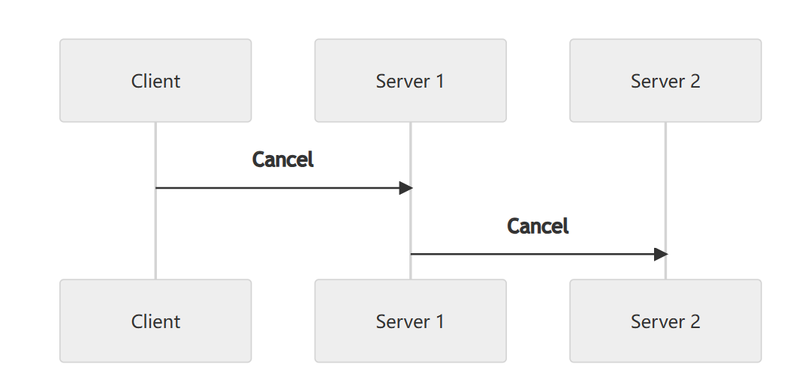
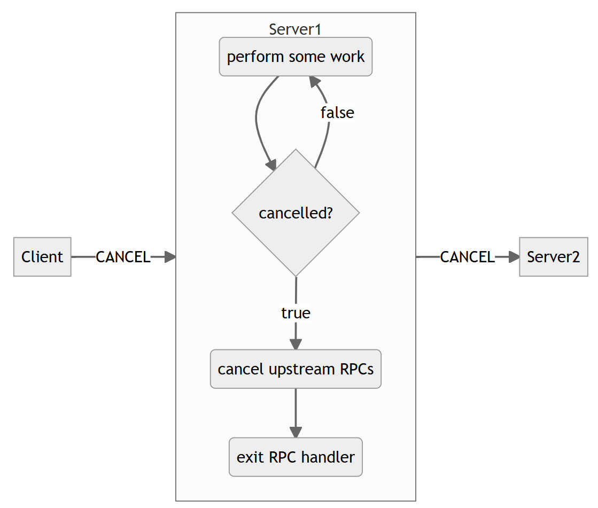

+++
title = "取消"
date = 2024-11-19T10:19:42+08:00
weight = 20
type = "docs"
description = "解释如何以及何时取消 RPC。"
isCJKLanguage = true
draft = false

+++

> 原文：[https://grpc.io/docs/guides/cancellation/](https://grpc.io/docs/guides/cancellation/)
>
> 收录该文档的时间：`2024-11-19T10:19:42+08:00`

# Cancellation - 取消

Explains how and when to cancel RPCs.

​	解释如何以及何时取消 RPC。

### Overview

When a gRPC client is no longer interested in the result of an RPC call, it may *cancel* to signal this discontinuation of interest to the server. [Deadline]() expiration and I/O errors also trigger cancellation. When an RPC is cancelled, the server should stop any ongoing computation and end its side of the stream. Often, servers are also clients to upstream servers, so that cancellation operation should ideally propagate to all ongoing computation in the system that was initiated due to the original client RPC call.

​	当 gRPC 客户端对 RPC 调用的结果不再感兴趣时，它可以 *取消* 以向服务器发出终止兴趣的信号。[截止时间]() 超时和 I/O 错误也会触发取消。当 RPC 被取消时，服务器应停止任何正在进行的计算并结束其流的一侧。通常，服务器也充当上游服务器的客户端，因此取消操作应理想地传播到系统中由于原始客户端 RPC 调用而启动的所有计算。

A client may cancel an RPC for several reasons. The data it requested may have been made irrelevant or the author of the client may want to be a good citizen of the server and conserve compute resources.

​	客户端可能因多种原因取消 RPC。例如，请求的数据可能已变得无关紧要，或者客户端的开发者希望节约服务器的计算资源。

### 在客户端取消 RPC 调用 Cancelling an RPC Call on the Client Side

A client cancels an RPC call by calling a method on the call object or, in some languages, on the accompanying context object. While gRPC clients do not provide additional details to the server about the reason for the cancellation, the cancel API call takes a string describing the reason, which will result in a client-side exception and/or log containing the provided reason. When a server is notified of the cancellation of an RPC, the application-provided server handler may be busy processing the request. The gRPC library in general does not have a mechanism to interrupt the application-provided server handler, so the server handler must coordinate with the gRPC library to ensure that local processing of the request ceases. Therefore, if an RPC is long-lived, its server handler must periodically check if the RPC it is servicing has been cancelled and if it has, cease processing. Some languages will also support automatic cancellation of anyoutgoing RPCs, while in others, the author of the server handler is responsible for this.

​	客户端通过调用调用对象上的方法（或在某些语言中，调用上下文对象上的方法）来取消 RPC 调用。虽然 gRPC 客户端不会向服务器提供取消原因的详细信息，但取消 API 调用接受一个描述原因的字符串，该字符串将导致包含提供原因的客户端异常和/或日志。当服务器被通知 RPC 被取消时，应用程序提供的服务器处理程序可能正在处理请求。一般而言，gRPC 库没有中断应用程序提供的服务器处理程序的机制，因此服务器处理程序必须与 gRPC 库协调以确保停止请求的本地处理。因此，如果 RPC 是长时间运行的，其服务器处理程序必须定期检查其服务的 RPC 是否已取消，如果是，则停止处理。一些语言还支持自动取消任何传出的 RPC，而在其他语言中，服务器处理程序的开发者需要负责这一点。

### Language Support

| Language | Example                                                      | Notes                                                    |
| -------- | ------------------------------------------------------------ | -------------------------------------------------------- |
| Java     | [Example](https://github.com/grpc/grpc-java/tree/master/examples/src/main/java/io/grpc/examples/cancellation) | 自动取消传出的 RPC - Automatically cancels outgoing RPCs |
| Go       | [Example](https://github.com/grpc/grpc-go/tree/master/examples/features/cancellation) | 自动取消传出的 RPC - Automatically cancels outgoing RPCs |
| C++      | [Example](https://github.com/grpc/grpc/tree/master/examples/cpp/cancellation) | 自动取消传出的 RPC - Automatically cancels outgoing RPCs |
| Python   | [Example](https://github.com/grpc/grpc/tree/master/examples/python/cancellation) |                                                          |
