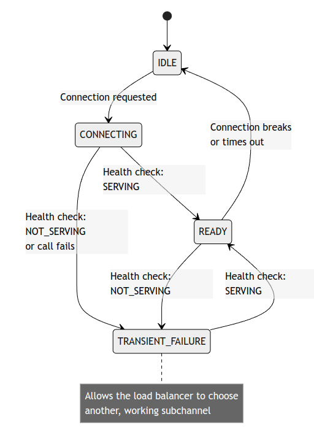

+++
title = "Health Checking"
date = 2024-11-19T10:19:42+08:00
weight = 110
type = "docs"
description = ""
isCJKLanguage = true
draft = false
+++

> 原文：[https://grpc.io/docs/guides/health-checking/](https://grpc.io/docs/guides/health-checking/)
>
> 收录该文档的时间：`2024-11-19T10:19:42+08:00`

# Health Checking

Explains how gRPC servers expose a health checking service and how client can be configured to automatically check the health of the server it is connecting to.


### Overview

gRPC specifies a standard service API ([health/v1](https://github.com/grpc/grpc-proto/blob/master/grpc/health/v1/health.proto)) for performing health check calls against gRPC servers. An implementation of this service is provided, but you are responsible for updating the health status of your services.

On the client side you can have the client automatically communicate with the health services of your backends. This allows the client to avoid services that are considered unhealthy.

### The Server Side Health Service

The health check service on a gRPC server supports two modes of operation:

- Unary calls to the

   

  ```
  Check
  ```

   

  rpc endpoint

  - Useful for centralized monitoring or load balancing solutions, but does not scale to support a fleet of gRPC client constantly making health checks

- Streaming health updates by using the

   

  ```
  Watch
  ```

   

  rpc endpoint

  - Used by the client side health check feature in gRPC clients

Enabling the health check service on your server involves the following steps:

1. Use the provided health check library to create a health check service
2. Add the health check service to your server.
3. Notify the health check library when the health of one of your services changes.
   - `NOT_SERVING` if your service cannot accept requests at the moment
   - `SERVING` if your service is open for business
   - If you don’t care about the health of individual services, you can use an empty string ("") to represent the health of your whole server.
4. Make sure you inform the health check library about server shutdown so that it can notify all the connected clients.

The exact details vary by language, see the **Language Support** section below.

### Enabling Client Health Checking

A gRPC client can be configured to perform health checks against the servers it connects to by modifying the [service config](https://github.com/grpc/grpc/blob/master/doc/service_config.md) of the channel. E.g. to monitor the health of the `foo` service you would use (in JSON format):

```json
{
  "healthCheckConfig": {
    "serviceName": "foo"
  }
}
```

Note that if your server reports health for the empty string ("") service, signifying the health of the whole server, you can also use an empty string here.

Enabling health checking changes some behavior around calling a server:

- The client will additionally call the

   

  ```
  Watch
  ```

   

  RPC on the health check service when a connection is established

  - If the call fails, retries will be made (with exponential backoff), unless the call fails with the status UNIMPLEMENTED, in which case health checking will be disabled.

- Requests won’t be sent until the health check service sends a healthy status for the service being called

- If a healthy service becomes unhealthy the client will no longer send requests for that service

- The calls will resume if the service later becomes healthy

- Some load balancing policies can choose to disable health checking if the feature does not make sense with the policy (e.g. `pick_first` does this)

More specifically, the state of the subchannel (that represents the physical connection to the server) goes through these states based on the health of the service it is connecting to.



Again, the specifics on how to enable client side health checking varies by language, see the examples in the **Language Support** section.

### Language Support

| Language | Example                                                      |
| -------- | ------------------------------------------------------------ |
| Java     | [Java example](https://github.com/grpc/grpc-java/tree/master/examples/src/main/java/io/grpc/examples/healthservice) |
| Go       | [Go example](https://github.com/grpc/grpc-go/tree/master/examples/features/health) |
| Python   | [Python example](https://github.com/grpc/grpc/tree/master/examples/python/health_checking) |
| C++      | [C++ example](https://github.com/grpc/grpc/tree/master/examples/cpp/health) |
